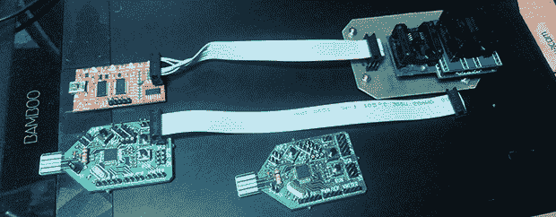

# 用较慢的硬件实现更快的性能指标评测

> 原文：<https://hackaday.com/2014/06/13/faster-benchmarks-with-slower-hardware/>

总线盗版是一种便宜、简单的电子原型瑞士军刀，能够对 FPGAs 编程，并写入闪存。uISP 可能是通过 USB 对 Atmel 芯片进行编程的最简单的方式，使用的组件不到 5 美元。虽然 uISP 使用较慢的芯片，并对 USB 协议进行位碰撞，[但事实证明，作为 SPI 闪存的程序员运行时，它实际上更快](http://ncrmnt.org/wp/2014/06/08/flashrom-benchmark-buspirate-vs-uisp/)。

[死灵法师]的大部分工作涉及闪存路由器之类的东西，他发现总线盗版太慢了，不合他的胃口——他花了四分钟的大部分时间来写一个 2 MiB 的 SPI 闪存。考虑到他不能做得更糟，他为 uISP 写了两个固件把一些数据放在闪存芯片上，一个是串行编程器，另一个是更优化的版本。

虽然 uISP 中的 ATMega 的运行速度大约是总线盗版中 PIC 的一半，但[死灵法师]发现优化的固件写入 8 MiB 闪存芯片的时间比总线盗版少了近一半。

这是一个令人印象深刻的成就，考虑到总线盗版者有一个专用的 USB 到串行芯片，uISP 正在对其 USB 连接进行位处理，而 BP 正在以更快的时钟运行。[尼布鲁]认为总线盗版的问题是带宽被限制在 115200 bps，或最大吞吐量为 14 kiB/s。消除这一障碍并优化延迟环路会使更便宜的设备更快。