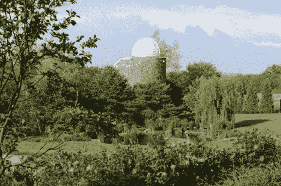

# 父子团队在后院天文台大展身手

> 原文：<https://hackaday.com/2012/07/19/fatherson-team-goes-big-with-backyard-observatory/>

哦那个？这只是我们去年夏天建造的后院天文台。你知道，为了好玩。我们想象这是 Kakon24 和他爸爸最近经常进行的对话。他们对天文学感兴趣，当他们在自己的家园上建造了一个巨大的天文台时，他们的设备升级了。现在我们并不宣称对天文台的质量了解很多，但这远远超出了大多数人所能获得的。

这也不是一个简单的构建。这是一个完全独立的建筑，从浇注的地基开始，然后是覆盖着石头的木条框架。这些图片讲述了建造的故事，但是关于硬件的信息，你会想通读 Reddit 天文学主题上的评论[。听起来像范围本身花费超过 10 万美元，所以有一个适当的建筑来保护它是必须的。](http://www.reddit.com/r/Astronomy/comments/weuhu/my_back_yard_observatory_with_06m_rc_as_requested/)