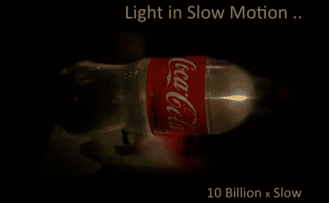

# 毫微微摄影:拍摄由光构成的子弹

> 原文：<https://hackaday.com/2012/08/17/femto-photography-taking-pictures-of-bullets-made-of-light/>

毫微微摄影是一个术语，它的名字来源于十亿分之一米制的前缀。当与摄影相结合时，这段时间小到足以看到成群的光子在移动。效果令人瞠目结舌。上图显示了一颗“轻子弹”穿过一个装满水的汽水瓶。这是[Ramesh Raskar]关于每秒 1 万亿帧成像的 TED 演讲的一部分。

这个视频有点像谎言。我们看到的不是一个单一的事件，而是无数离散事件的照片被拼接成一个视频。但这并没有削弱相机实现如此短曝光时间的惊人能力。事实上，这种能力结合花哨的代码可以做另一件非常神奇的事情。它可以在拐角处拍照。就像上面的图像一样，激光脉冲光子弹，但光束被表面反射，相机捕捉到了光的“回声”。一台计算机可以将这些组合起来，并建立一个超出相机视线的图像。

休息之后你会发现整个演讲都被嵌入了。

[https://embed.ted.com/talks/ramesh_raskar_a_camera_that_takes_one_trillion_frames_per_second](https://embed.ted.com/talks/ramesh_raskar_a_camera_that_takes_one_trillion_frames_per_second)

[谢谢皮姆]