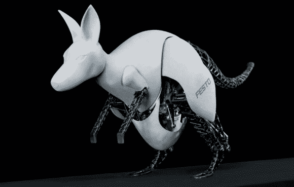

# 费斯托创造仿生袋鼠；史蒂夫·奥斯汀不为所动

> 原文：<https://hackaday.com/2014/04/08/festo-creates-bionic-kangaroo-steve-austin-unimpressed/>

[威尔弗莱德·斯托尔博士]和 Festo 的一个团队创造了一只令人难以置信的机器袋鼠。每隔几年，Festo 的研究团队就会发布一款受动物启发的神奇机器人。我们上次报道了他们的[智能鸟](http://hackaday.com/2011/03/30/robotic-bird-flaps-away-last-bits-of-privacy/)。今年，他们创造了 [BionicKangaroo](http://www.festo.com/net/SupportPortal/Files/334103/Festo_BionicKangaroo_en.pdf) (pdf 链接)。虽然 600 万美元的富翁可能会有不同的建议，但是仿生学是在工程设计中使用生物系统。在这种情况下，Festo 的工程师花了两年时间研究袋鼠的跳跃行为，因为他们完善了他们的创作。

袋鼠对跳跃有着惊人的进化适应能力。它们强大的跟腱在着陆时储存能量。这使得袋鼠在每次连续跳跃时增加速度。当袋鼠在空中跳跃时，它的尾巴对于保持平衡至关重要。Festo 团队使用一根粗橡皮筋来复制肌腱的动作。尾部由电动伺服马达控制。

Festo 以他们的气动元件而闻名，所以袋鼠的腿由气缸驱动也就不足为奇了。然而气动需要空气供应，所以团队创造了两种版本的袋鼠。第一种使用车载空气压缩机。第二种是用高压储存罐驱动袋鼠的腿。一个现成的[可编程逻辑控制器](http://en.wikipedia.org/wiki/Programmable_logic_controller) (PLC)充当了 BionicKangaroo 的大脑。PLC 监控平衡，同时控制气动腿部气缸和电动尾部电机。不幸的是，BionicKangaroo 并不是完全自主的。 [Thalmic Labs Myo](https://www.thalmic.com/en/myo/) 在视频中客串出场。袋鼠的人类控制器用简单的手臂动作来指挥机器人。

虽然 BionicKangaroo 的跳跃很优雅，但在转弯和采取简单步骤时，它仍然需要一点帮助。谢天谢地，我们不认为它会很快成为拳击赛。

[https://www.youtube.com/embed/_4luJ0ZSqy8?version=3&rel=1&showsearch=0&showinfo=1&iv_load_policy=1&fs=1&hl=en-US&autohide=2&wmode=transparent](https://www.youtube.com/embed/_4luJ0ZSqy8?version=3&rel=1&showsearch=0&showinfo=1&iv_load_policy=1&fs=1&hl=en-US&autohide=2&wmode=transparent)