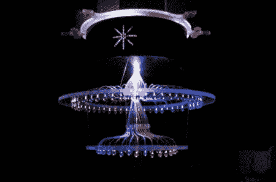

# 带无线控制的光纤吊灯

> 原文：<https://hackaday.com/2012/05/02/fiber-optic-chandelier-with-wireless-controls/>

在 Ebay 上看到一个售价超过 1000 美元的光纤吊灯后，【Apex Logic】[认为他可以自己做一个](http://apexlogic.net/projects/fiber-optic-chandelier-prototype/)不仅更便宜，而且功能更多。他追求的一些功能是无线控制，具有完全 RGB 控制的能力，当然还有定制的外观。正如你在下面的视频中所看到的，他完成得非常漂亮。他有一个无线控制器，3 个滑块代表 RGB，你可以在下面的第二个视频中一瞥。

他的包含构建细节和代码的页面今天早上似乎遭遇了厄运。[这里是](http://apexlogic.net)，等它回来的时候。

[途径 [Adafruit](http://www.adafruit.com/blog/2012/05/01/fiber-optic-chandelier-prototype-with-atmega328-and-xbee/)

[https://player.vimeo.com/video/41103715](https://player.vimeo.com/video/41103715)[https://player.vimeo.com/video/41169837](https://player.vimeo.com/video/41169837)