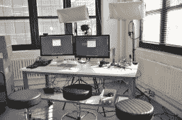
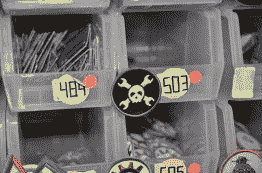
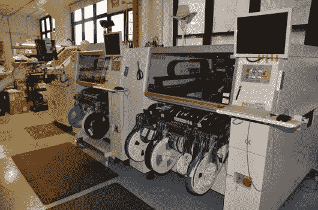
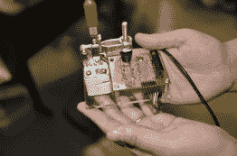
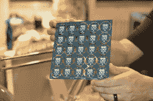

# 实地考察！Hackaday 参观 Adafruit 工业

> 原文：<https://hackaday.com/2015/05/08/field-trip-hackaday-visits-adafruit-industries/>

虽然我们的 TechCrunch Disrupt Hackathon 仍然令人厌倦，但 Hackaday 的工作人员有一个我们不能错过的机会:参观 Adafruit Industries。Adafruit 不对公众开放，所以有机会看到黑客/创客行业最大的公司之一的内部运作真的很特别。

离开曼哈顿下城熙熙攘攘的街道，我们发现自己来到了一个毫不起眼的白色大理石大厅。对比和颜色让我想到了 THX1138 的一个场景。乘坐电梯很快就可以到达第二个大厅，那里有一扇大门。然而，我们并不孤单——一个安全摄像头默默见证。当开门的不是别人，正是[菲尔·托伦]欢迎我们来到阿达果时，任何关于老大哥的想法都被平息了。

如果你看过 Adafruit 办公室的任何照片或视频，你就会知道会发生什么——一个巨大的开放空间，被保持大楼 10 层直立的柱子打破。这是建立一家公司的完美的空白画布。由于我们是在周日下午晚些时候到达那里的，所以事情相对平静。80 名员工中只有少数人在自己的岗位上。那些手头的人正在打包和扫描订单，为忙碌的周一做准备。站在 Adafruit 有点困难，因为你知道你想要的每个部件、模块或设备都触手可及，而不想马上投入到一个项目中。虽然我们有 10 个人在那里，但这可能对 Adafruit 的底线造成了一点影响。

 [![[Phil] shows off Adafruit's Fona module](img/568023d506be3fb4af0836d884e43f3a.png "_DSC5868")](https://hackaday.com/2015/05/08/field-trip-hackaday-visits-adafruit-industries/_dsc5868/) [Phil] shows off Adafruit’s Fona module  The Circuit Playground characters

参观从[菲尔的]办公桌开始。夹在一本非常体面的图形小说集《沙丘》和两个最新版本的《电子艺术》中间的是《美国出口管制》第七版。考虑到公司每天要向遥远的国家运送大量货物，人们必须了解 ITAR 和其他出口法律等小事。

在整个参观过程中，[Phil]明确表示他认为自己的工作很简单:尽一切可能让[Limor]做出设计。[Phil]保持业务运营，这样她就可以继续设计开源硬件。[Phil]的作品在产品标识和出现在 Adafriut 赛道上的人物身上闪耀着光芒。如果这些视频让你觉得是小孩子的东西，那就是它们的设计初衷。在 Make 任职期间，[Phil]是 2006 年经营第一家 Makerfaire 的四个人之一。他仍然会收到一些人的电子邮件，这些人小时候参加过这个项目，并受到启发进入了工程或计算机科学领域。[菲尔]和[利莫尔]都着眼于激励下一代黑客。

我们参观的下一个地方是可穿戴设备部，这是独一无二的贝基·斯特恩的领域。我们都被这个地区令人难以置信的整洁和有序所震惊。每样东西都有一个贴好标签的地方，每样东西都在它的位置上。展出的是一件灰色连帽衫，上面有一个 ninjaflex 3D 打印子弹的弹带，全部由 RGB LEDs 照明。

点击休息时间，继续 Hackaday 的 Adafruit Industries 之旅！

走过整整一托盘的《电子艺术》第三版和两托盘的 Rigol DS1054Z 示波器，我们来到了“询问工程师”工作室，一张位于大楼远处角落的桌子。互联网上最大的现场黑客/制造者秀之一来自 MacBook Air 和几个摄像头。

 [![[Becky's] Wearable Zone](img/184cbc582c01076a97187feaab59f7c6.png "_DSC5860")](https://hackaday.com/2015/05/08/field-trip-hackaday-visits-adafruit-industries/_dsc5860/) [Becky’s] Wearable Zone  Ask An Engineer  The Hackaday Badge. Two left in stock.

我们慢慢走向生产区，由 Adafruit 的两台三星(Samsung)取放(PnP)机器占据。PnP 是电子世界的圣杯。它们必须精确，必须快速，而且看起来令人着迷。周末的这个时候，PnPs、回流炉和模版机都很安静。[Phil]解释了效率专家是如何通过并震惊地看到机器被关闭的。通常像这样的系统是全天候运行的。为什么 Adafruit 不接合同工作来填补他们多余的 SMT 线路带宽？这一切都是为了专注于核心产品。用[菲尔]自己的话说，“我有两个肾，但我不会为了更有利可图而把一个借出去”。

  Pick and Place machines  Test fixture  Gemma Boards [![[Limor] at her desk](img/c27dc026a9d0a598056b9eb5a82a067d.png "limor")](https://hackaday.com/2015/05/08/field-trip-hackaday-visits-adafruit-industries/limor/) [Limor] at her desk

我们的旅行最终来到了[利莫尔]的办公桌前。[Limor "LadyAda" Fried]无需介绍。十多年来，她一直站在创客运动的最前沿。如果你想要一份简历，请查看 Hackaday 奖的[评委页面。我们发现[Limor]坐在她的桌子后面，正在为 Adafruit 的一些最新的主板进行测试。该夹具是激光切割丙烯酸树脂、3D 打印部件、铣削 PCB 和弹簧针的混合物。将待测试的板滑入并用肘节夹固定到位。弹簧针连接到测试点。与 Adafruit 的许多测试装置一样，Arduino Uno 驱动整个系统。由于 Adafruit 出售许多他们认为有用的工具，所以在网站上可以买到肘节夹和弹簧针。](https://hackaday.io/prize/judges)

[Limor]通过她的一些工具和过程唤醒我们，回答我们关于她的技术的问题。她和[Phil]甚至传阅了即将推出的 Metro Mini 板，以及新版的 Gemma。虽然我们该上路回家了，但时间过得太快。Hackaday 团队的许多成员要赶火车或飞机。我们想借此机会感谢[Phil]和[Limor]的热情款待——我们的 Adafruit industries 之旅既精彩又鼓舞人心！