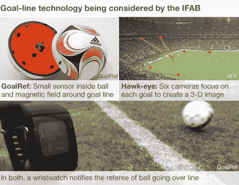

# 国际足联着眼于电子扩增

> 原文：<https://hackaday.com/2012/07/04/fifa-looks-at-electronic-augmentation/>

[国际足球联合会]正在加入越来越多的采用技术手段试图帮助人类裁判的职业体育行列。在 2010 年的一次拙劣的呼叫后，该组织呼吁建立一个可以日夜工作的系统，具有 100%的准确性和在不到 1 秒钟内向裁判报告的能力。申请人已经被淘汰，最终归结为两个系统，这两个系统都使用我们非常熟悉的个人硬件。发来提示的[Fe80]认出了上图中的 TI Chronos eZ430 手表。

这两个系统都使用手表作为接口，但工作方式非常不同。第一种叫做 GoalRef，使用一个悬浮在球内的传感器。这可以探测到由球门柱组成的磁场。我们猜测这是一个电感传感器，当它通过球门柱中的线圈时就会被触发(我们在[技术信息](http://en.wikipedia.org/wiki/Goal-line_technology#Goalref)中没有找到太多信息，所以请在评论中做出自己的猜测)。第二个系统非常熟悉。这是 APT(网球)在所有主要比赛中使用的鹰眼摄像系统。