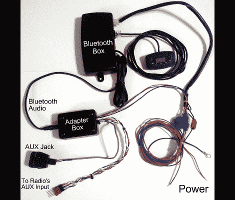

# 50 美元让你的汽车音频蓝牙兼容

> 原文：<https://hackaday.com/2012/04/18/fifty-dollars-to-make-your-car-audio-bluetooth-compatible/>

我们对[Aaron]为他的 2008 年本田增加蓝牙连接所做的工作印象深刻。他使用了一个售后套件，但加入了自己的修改，使它看起来和感觉起来像是一个原始功能。

在对昂贵的坞站系统感到失望后，他以大约 35 美元的价格买了一套 Jensen BT360 套件。它配有一个外部扬声器，安装在仪表板上会看起来很可怕。该扬声器旨在通过蓝牙播放您的电话音频，而手机中的音乐则通过调频发射机发送到汽车音响。因为他计划将控制单元藏在仪表板下，所以添加一些电线来拦截馈送到 FM 发射器的音频并不困难。从那里，他添加了几个继电器来自动路由音频信号(当存在时)，并把整个事情接入辅助输入。这样，他不需要额外的扬声器，所有的声音都通过电线而不是无线电传输传到主机。

最终的设置工作得很好。如果有电话打进来，它会自动将音量静音，或者暂停 iPod，如果这是当前通过 Aux 端口播放的内容的话。[Aaron]认为通过蓝牙播放音乐的低音不如使用辅助端口时丰富，但如果你不介意电缆，这也是一种选择。