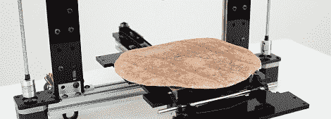

# 最后，一台卷饼的 3D 打印机

> 原文：<https://hackaday.com/2012/06/16/finally-a-3d-printer-for-burritos/>

[Marko]创造了一个打印墨西哥卷饼的机器人。的确，作为一个物种，我们已经达到了新的高度。

卷饼 0t 是基于 [ORD Hadron 3d 打印机](https://www.inventables.com/technologies/ord-bot-hadron-3d-printer-mechanical-platform)和一对基于空气压缩机/注射器的挤出机，基于 [Makerbot Frostruder](http://www.thingiverse.com/thing:1143) 。所有的配料——大米、肉、沙拉和融化的奶酪——都将被印在由 Makerbot [加热构建平台](http://store.makerbot.com/heated-build-platform-supplementary-pack-thing-o-matic.html)加热的玉米粉圆饼表面。

[马尔科]对他的墨西哥卷饼有一些非常好的计划，比如[一个订购墨西哥卷饼的 iPhone 应用程序](http://burritob0t.com/?p=39)和[一些使用墨西哥卷饼的社会评论](http://burritob0t.com/?p=33)。我们假设由于缺少任何动作镜头或演示视频，[Marko]还没有启动和运行这个玉米煎饼。也就是说，有一个精彩的 [Flickr 画廊](http://www.flickr.com/photos/laserpirate/sets/72157629607299135/)和一个关于页面的[，它涵盖了卷饼背后的艺术陈述。](http://burritob0t.com/?page_id=23)

如果你想得到自己的墨西哥卷饼，[Marko]希望在 7 月份的某个时候有一个 Kickstarter。