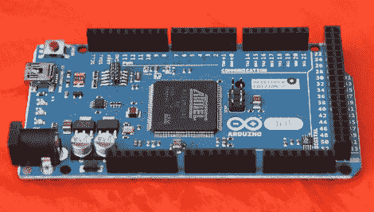

# 最后，一个 ARM 驱动的 Arduino

> 原文：<https://hackaday.com/2012/10/03/finally-an-arm-powered-arduino/>

与今年纽约 Maker Faire 展出的众多 3D 打印机相比，一个更小但更令人印象深刻的公告是:ARM 驱动的 Arduino 将于本月晚些时候发布。

与 Arduinos 中常见的 8 位 AVR 微控制器不同，DUE 由一个 [ATSAM3X8E](http://www.atmel.com/devices/SAM3X8E.aspx) 微控制器供电，该微控制器本身基于 ARM Cortex-M3 平台。有几个非常漂亮的功能即将推出，即一个 USB 端口，允许制造商和修补程序连接键盘，鼠标，智能手机(嘿，有人应该把 IOIO 固件移植到这个东西上)，以及*也许*甚至标准的桌面喷墨或激光打印机。

该板看起来与已经常见的 Arduino Mega 惊人地相似。那不是错误；DUE 与现有的防护罩兼容，因此为您的 3D 打印机连接一个斜坡板应该很容易。

这是 Arduino 和 Atmel 的人在他们的展台上分发的 PDF 文件。一些应得的板子已经交到了 Arduino 社区的重要人物手中，包括 3D 打印机大师[Josef Prusa]。可悲的是，Arduino 的人认为媒体人物在发布之前不需要一个 DUE，所以你必须等到我们在本月晚些时候得到一个评论。