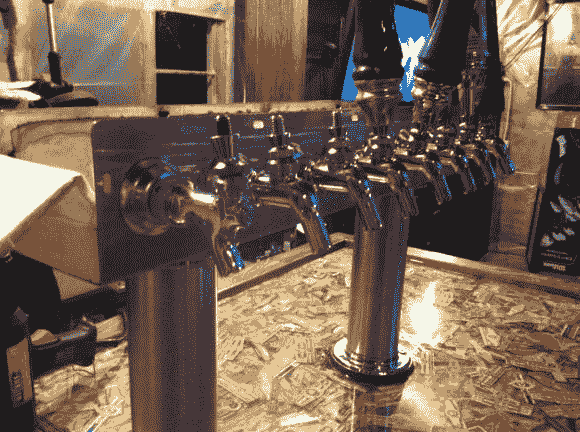

# 精致的家具餐厅供应大量啤酒；抽很多雪茄

> 原文：<https://hackaday.com/2013/10/15/fine-furniture-kegerator-serves-a-lot-of-beer-smokes-a-lot-of-cigars/>

这个 kegerator 看起来像是一件精美的家具，但对其结构的仔细检查表明，它至少有一部分是由木头拼凑而成的。如同这个想法的大多数多桶变体一样，这从卧式冷冻柜开始，但它没有像通常情况那样[利用定制的项圈](http://hackaday.com/2013/04/16/building-a-kegerator-with-visual-style/)。

在为这些啤酒塔在冰柜的盖子上切好孔后，Lorglath 开始用小孔螺钉在它周围建造一个木制框架。尽管他努力保持东西垂直和方正，但当用橡木胶合板包裹它并添加装饰件时，还是做了一些…创造性的…填隙。但知道在哪里隐藏瑕疵让他通过了项目的这一部分，并完成了表面处理。仔细看上面的图像，所有这些碎片都是雪茄环。那代表有很多烟！

这些环被分层放置，每层之间都有薄薄的树脂灌注。为了获得光滑和清晰的表面，使用了一个热风枪来平整表面，并戳破任何进入粘性物质的气泡。成品有空间储存八个小桶，这些小桶连接到上面的水龙头。那要酿很多啤酒，也要喝很多！