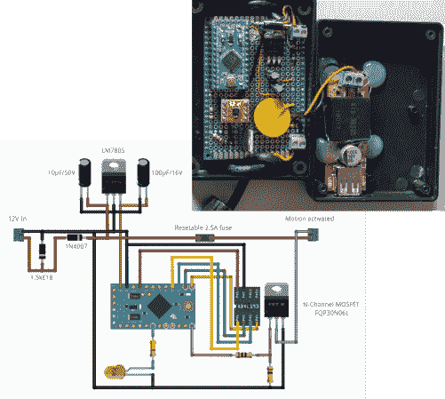

# 首先刺向运动传感器，断开汽车充电器

> 原文：<https://hackaday.com/2014/03/24/first-stab-at-motion-sensor-to-disconnect-a-car-charger/>

[Pixel]刚刚发来的这个汽车黑客[在车辆停止行驶至少 10 分钟后断开他的车载充电器](http://www.knackes.com/blog/index.php/2014/03/arduino-adxl362-motion-activated-12v-switch-en-anglais/)。你为什么需要这样的东西？当点火开关关闭时，他车上的 12V 电源插座没有断开。如果他在停车时让充电器插着，他经常会回到一个耗尽的电池。

fritzing 图讲述了这个黑客的故事。他用 7805 给 Arduino mini 供电。它监控 ADXL362 加速度计，当该芯片不再检测到运动时开始倒计时。在第 10 分钟时，N 沟道 MOSFET 断开插座的接地端。适用于[Pixel]在热端包含可重置保险丝。但是最左边的二极管引起了我们的注意。原来这是论坛帖子中推荐的[滤波电路的一部分。这是一个齐纳二极管，作为](https://forum.sparkfun.com/viewtopic.php?f=42&t=37801)[一个瞬态电压抑制二极管](http://en.wikipedia.org/wiki/Transient-voltage-suppression_diode)。

该帖子的另一个评论提出了我们也注意到的问题。7805 线性调节器持续通电。您认为让 uC 进入睡眠状态并保持线性调节器连接是一个合适的解决方案吗？如果不是，你会怎么做？