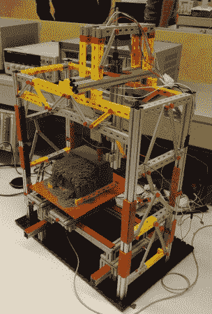

# 慧鱼数控机床看起来无辜，而削减你的脸

> 原文：<https://hackaday.com/2014/08/01/fischertechnik-cnc-machine-looks-innocent-whilst-cutting-your-face/>

你好，艾琳！从荷兰远道而来的这台[相当独特的数控铣床](http://blog.arduino.cc/2012/06/25/arduino-based-milling-machine/)是由代尔夫特理工大学的几名机械工程学生制造的。这些家伙只有一周的时间来建造工厂，以满足他们机电课的要求。不幸的是，在展示机器工作后，它不得不被拆卸。

如果这个框架看起来有点像玩具，那是因为它确实如此。这种特殊的系统被称为[慧鱼](http://www.fischertechnik.de/en/Home.aspx)，主要支撑梁类似于铝挤压(例如 [80/20](http://www.8020.net/) 、 [Misumi](http://us.misumi-ec.com/vona2/mech/M1500000000/M1501000000/) )的支撑梁，只是它是由尼龙制成的。请注意极长的切割钻头和相对异常大的 Z 轴移动能力。这种系统缺乏的刚性通过能够雕刻出具有陡峭侧面的*非常* 3D 形状来弥补，而机器不会撞击工件。刚性的损失是完全可以接受的，因为团队只计划切割泡沫，项目的目的是学习机械和自动化。

控制系统也有点独特。虽然它使用 Arduino 和现成的步进驱动器，但运行修改版 [MATLAB](http://www.mathworks.com/products/matlab/) 的计算机向 Arduino 发送命令，Arduino 反过来向电机控制屏蔽和一个 [EasyDriver](https://www.sparkfun.com/products/10267) 发送步进和方向信号。步进电机负责移动所有 3 个轴。Z 轴由丝杠驱动，而 X 轴和 Y 轴基于齿条和小齿轮。

正如你从上面的照片中看到的，这个数控程序去除了大量的材料，使得最终结果隐藏起来，直到工件被真空吸走。学生们不得不焦虑地等了好一会儿，才目睹他们的机器是如何运转的。

[https://www.youtube.com/embed/tqon5O-cKTM?version=3&rel=1&showsearch=0&showinfo=1&iv_load_policy=1&fs=1&hl=en-US&autohide=2&wmode=transparent](https://www.youtube.com/embed/tqon5O-cKTM?version=3&rel=1&showsearch=0&showinfo=1&iv_load_policy=1&fs=1&hl=en-US&autohide=2&wmode=transparent)