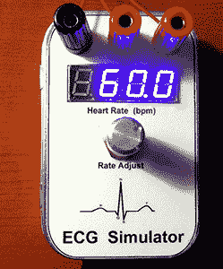

# 把一颗冰冷的金属心脏装进罐子里

> 原文：<https://hackaday.com/2013/01/24/fitting-a-cold-metal-heart-in-an-altoids-tin/>

[詹姆斯]一直在用一种非常酷的 TI 芯片制造心率监测器。他需要一种方法来测试他的设备，而商业心电图模拟器，像所有的生物技术设备一样，贵得离谱。[James] [决定建造自己的心率模拟器](https://github.com/lynchzilla/ecg_simulator)，在这个过程中，他创造了一个伟大的工具，也是我们见过的记录最完整的项目之一。

当然，如果你正在构建一个心电图模拟器，你将需要一个良好的心脏电模式样本。为了得到这个样本，[James]找到了一本旧的军队手册，上面有一个理想心电图模式的图表。[James]拿着这本 PDF 手册，在屏幕上覆盖了图表，并使用 Python 脚本在 C 中生成了一个 Arduino 可以反复重复的数组。

其余部分包括一个数模转换器，一个改变心率的罐子，一个非常漂亮的七段显示器，以及几个连接到[詹姆斯]心脏监视器的香蕉插孔。一切都在 git 中，包括一份令人惊讶的详细记录(87 页！)自建 Arduino 心脏模拟器教程。