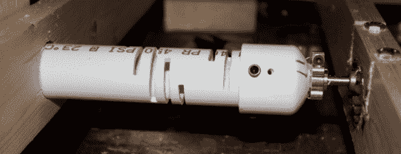

# 用切口弯曲固定错位的 PVC

> 原文：<https://hackaday.com/2014/04/04/fixing-misaligned-pvc-with-kerf-bends/>

我们的老朋友[杰里米·库克]正在做他自己的[西奥·詹森]的 Strandbeest 混音，和原版一样，他用的是 PVC 管。与原版不同的是，他用马达为它提供动力，而不是风力，这在通过一块 PVC 传输机械动力时引起了一些问题。没有什么是完美的，在腿部运动的几个点上，轴会剧烈地抖动。一个马达丢了，另一个也差点丢了，后来[杰里米]发明了一种用聚氯乙烯制成的挠性耦合器。

杰里米正在使用的技术已经在人们建造激光切割围栏的过程中得到了大量应用。这被称为切口弯曲，它的工作原理很简单，就是在面板上切几条缝，让它稍微弯曲一下。[Jeremy]在斜切锯上复制了这种技术，在一英寸的 PVC 管中间切割八个槽，每次连续切割偏移 90 度。

新的设计很好地传输动力，他不再破坏马达了。看看下面的视频。

[https://www.youtube.com/embed/xZzkBMySk94?version=3&rel=1&showsearch=0&showinfo=1&iv_load_policy=1&fs=1&hl=en-US&autohide=2&wmode=transparent](https://www.youtube.com/embed/xZzkBMySk94?version=3&rel=1&showsearch=0&showinfo=1&iv_load_policy=1&fs=1&hl=en-US&autohide=2&wmode=transparent)