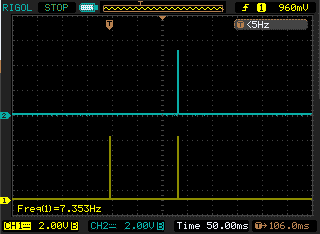

# 闪光灯控制器与傻瓜相机配合使用

> 原文：<https://hackaday.com/2012/11/25/flash-controller-works-with-point-and-shoot-cameras/>

不用说，专业摄影师使用的昂贵的 DSLR 相机和普通人携带的傻瓜相机之间有着天壤之别。其中一个区别是使用从属闪光灯的能力——第二个闪光灯设置在拍摄对象的侧面，以获得更好的照明。这些从属闪光灯大多是在看到强光或相机闪光灯关闭时触发的。指向和拍摄模式通常有一个“预闪光”，导致从闪光灯过早触发。[Kerry] [制作了一个非常简洁的 slave flash](http://www.kerrywong.com/2012/11/23/advanced-slave-camera-flash-controller/) ，它能够与这些傻瓜相机一起工作，并且非常容易制作。

有两种选择来构建一个可以使用傻瓜相机的闪光灯:首先，测量预闪光和真正闪光之间的时间，然后简单地延迟从闪光。这个选项有几个问题。即使[Kerry]在同一台相机上测试这种技术，闪光之间的延迟也不一致。

第二种选择是简单地忽略预闪并与主闪同步。这有点难，但如果做得好，这种技术几乎是万无一失的。

[Kerry]最终用一个 556 定时器芯片和一个 LM339n 比较器构建了一个小电路，它在看到预闪光后会自动“开启”。从那里，该设备寻找主闪光灯，每当它看到另一个明亮的光源时就会触发它。

成品工作得非常漂亮，而且简单到几乎任何人都可以在一块 perf 板上构建。