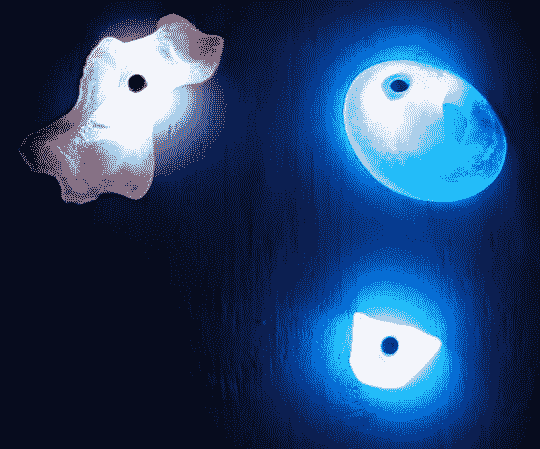

# 闪光。它:RGB LED 爬墙

> 原文：<https://hackaday.com/2013/09/19/flash-it-the-rgb-led-climbing-wall/>

[Chris]和他的朋友们正在讨论一个燃烧人项目的想法，这是一个坚持下来的想法:[一面嵌有 RGB led](http://www.instructables.com/id/LED-Climbing-Holds/)的攀岩墙。货舱本身是定制的；该小组首先制作不同形状和大小的硅胶模具，然后添加电子设备，并注入聚氨酯树脂来制作铸件。这些发光二极管的电路板上有一个中心孔，与硅胶模具中的销钉配对。[Chris]还通过在 LED 板的远端固定一个螺栓解决了一个恼人的旋转问题:一旦嵌入聚氨酯，螺栓就可以提供薄板无法提供的阻力。完成后的把手栓在墙上，所有的电线整齐地从后面伸出来，连接到中央控制器上。

Instrucables 页面建议了一些让灯工作的方法，包括抓取最近的 Arduino 和依赖 Adafruit 的[新像素库](https://github.com/adafruit/Adafruit_NeoPixel)。然而,[Chris]为 Burning Man 做了更多的工作，设计了 Arduino-软件兼容的控制器板，能够通过 [DMX](http://en.wikipedia.org/wiki/DMX512) 进行通信，这将系统从简单的显示扩展到能够进行更复杂的照明控制。[在 Github](https://github.com/ikea-lisp-code/diodberg/tree/master/schematics) 停下来看原理图和 PCB 布局，休息后留下来看墙的视频。如果你内心渴望寻求刺激的户外运动者渴望更多，那么[看看今年夏天早些时候的 WALL-O-TRON](http://hackaday.com/2013/06/26/wall-o-tron-the-interactive-rock-climbing-wall/)。

[https://www.youtube.com/embed/89l5KwsrFlQ?version=3&rel=1&showsearch=0&showinfo=1&iv_load_policy=1&fs=1&hl=en-US&autohide=2&wmode=transparent](https://www.youtube.com/embed/89l5KwsrFlQ?version=3&rel=1&showsearch=0&showinfo=1&iv_load_policy=1&fs=1&hl=en-US&autohide=2&wmode=transparent)