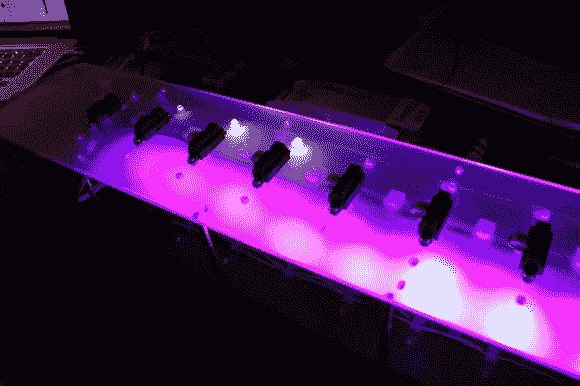

# FlightDeck:“无触摸”MIDI 控制器

> 原文：<https://hackaday.com/2013/10/18/flightdeck-a-touchless-midi-controller/>

[爱德华]想要一种不同的方式来调制他的 MIDI 控制器上的音符，所以他[决定去无触摸](http://edwardperks.com/projects/flightdeck.html)。受他的 Edirol 键盘上的压力感应调制的启发，[Edward]将八个传感器排列成一排可弹奏的音符，并使用红外线来感应玩家的手与按键的距离。他还包括一些功能按钮，可以在 10 个八度音阶之间循环，桌子下面的 RGB LEDs 可以随着音乐一起播放。

他选择了[夏普 GP2D120 传感器](http://www.sharpsma.com/webfm_send/1205)(直接链接到数据手册)，因为它们的阈值较低，允许电路板检测传感器附近的距离。每个都被安装在一张磨砂丙烯酸板上，带有自己的“保持音符”按钮和一个指示该键正在播放的 LED。下面板装有驱动系统的 Arduino Mega，以及 RGB LED 灯条及其驱动板。[Edward]使用 [Maxuino](http://www.maxuino.org/) 和 [OSC-Route](http://cnmat.berkeley.edu/patch/4029) 将 Mega 连接到运行该节目的 Max/MSP 补丁。

休息后，在控制器和软件的视频演示中了解更多关于 FlightDeck 的功能，然后查看其他一些 MIDI hacks，如[风琴踏板](http://hackaday.com/2013/04/10/midi-pedal-project-looks-as-good-as-it-sounds/)或 [Arduino 驱动的 MIDI 音序器](http://hackaday.com/2013/02/22/arduino-controlled-midi-sequencer/)。

[https://www.youtube.com/embed/lzDt3wS-olE?version=3&rel=1&showsearch=0&showinfo=1&iv_load_policy=1&fs=1&hl=en-US&autohide=2&wmode=transparent](https://www.youtube.com/embed/lzDt3wS-olE?version=3&rel=1&showsearch=0&showinfo=1&iv_load_policy=1&fs=1&hl=en-US&autohide=2&wmode=transparent)

[https://www.youtube.com/embed/wrymDqGF3VY?version=3&rel=1&showsearch=0&showinfo=1&iv_load_policy=1&fs=1&hl=en-US&autohide=2&wmode=transparent](https://www.youtube.com/embed/wrymDqGF3VY?version=3&rel=1&showsearch=0&showinfo=1&iv_load_policy=1&fs=1&hl=en-US&autohide=2&wmode=transparent)