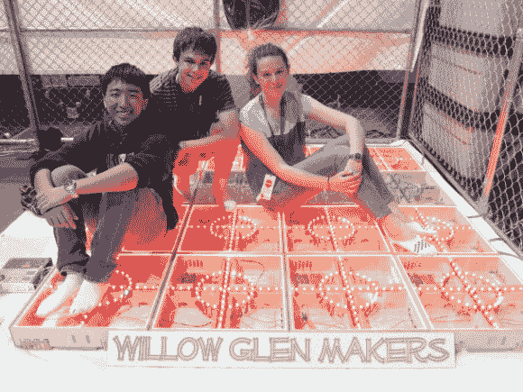

# FlowFree 在纽约的 Maker Faire 上进行真人大小的测试

> 原文：<https://hackaday.com/2013/09/22/flowfree-goes-life-sized-at-maker-faire-ny/>

最初的智能手机游戏变成了 2013 年纽约(Willow Glen Makers)的 Maker Faire 项目。 [FlowX26 是游戏 FlowFree](https://sites.google.com/site/teampathfinderdsm/) 的真人大小版本。[柳树谷制造商]想要建立一个可扩展的，易于安装的地砖网格来模拟游戏。使用 CNC 机器来制造胶合板框架。图中看不到的是，每个横梁都被切割成略微凹陷的形状。这种凹度允许透明塑料顶部偏转，足以启动瓷砖内部的微型开关。开关向瓷砖的 Arduino Mega 控制器发送信号。Mega 然后使用这些数据来控制 RGB LEDs 阵列。

下一个问题是瓦片之间的互连和通信。[制造商]使用铜带，以及每个瓷砖侧面之间的 3D 打印闩锁系统。每侧六个连接允许电力和数据在整个电网中传输。

虽然网格的硬件已经启动并运行，但软件仍在开发中。在 Maker Faire 这里，网格正在运行一个基本的演示。每个瓷砖通常是红色的。当一个人踩在瓷砖上时，它会变成绿色。一旦移除重量，瓷砖会慢慢变回红色。这足以让创客集市上的孩子们开心不已。任何时候都有几个孩子从一片瓦走到另一片瓦，看着他们的脚步在身后消失。