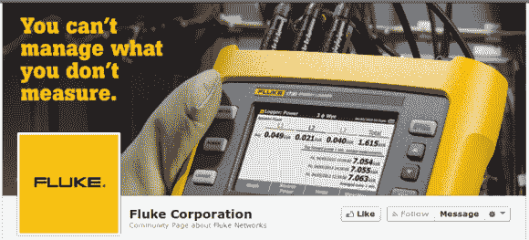

# 福禄克就 Sparkfun 被扣押的万用表发表声明

> 原文：<https://hackaday.com/2014/03/20/fluke-issues-statement-regarding-sparkfuns-impounded-multimeters/>

福禄克公司刚刚发布了[对美国市场万用表](https://www.facebook.com/notes/fluke-corporation/sparkfun-we-hear-you/10151978262765592)被扣押的回应。昨天 SparkFun 发布了他们关于[美国海关官员因为商标](http://hackaday.com/2014/03/19/multimeters-without-a-country-flukes-broad-trademark-bans-yellow-multimeter-imports/)问题扣押 2000 只万用表的报道。回应的要点是，这种情况很糟糕，他们想尽他们所能来减轻相关人员的痛苦。福禄克正在向 SparkFun 提供一批真正的福禄克数字多媒体播放器，他们可以出售这些播放器来弥补损失或进行捐赠。当然，SparkFun 正计划将这些仪表捐赠给创客社区。

任何有线索的人都会注意到这个解决方案的问题。被扣押的 2000 米还是会被销毁…嗯。浪费是发自内心的。但福禄克尝试做一些积极的事情是好事。

在我们结束之前，让我们稍微谈一下商标问题。我们真的不能为此过多地责怪福禄克。问题的法律症结在于，要么你在每一个案件中保护你的商标，要么你根本不保护它。在这种情况下，是边境代理为申请辩护，但为了便于理解，我们不会深入探讨。另一方面，用一般的商业术语来说，事情是这样建立的，获得尽可能广泛的商标规范是有利的，因为它有助于阻止竞争者进入市场。因此，当商标阻止小贩试图敲诈消费者时，它是好的。但如果作为捍卫公司市场份额的一种方式而应用得过于广泛，那就不好了。

福禄克在这一切中处于什么位置？谁知道呢。事实上没有正确的答案，这就是为什么昨天的帖子引起了激烈的争论。福禄克电表是精华设备，他们有权利(也有义务)确保声誉不受玷污。SparkFun 服务的市场目前可能承受不起侥幸，但在未来的某一天可能会如此。这就是我们对这个结果感到满意的原因。

[via [Twitter](https://twitter.com/sparkfun/status/446740042367520768)