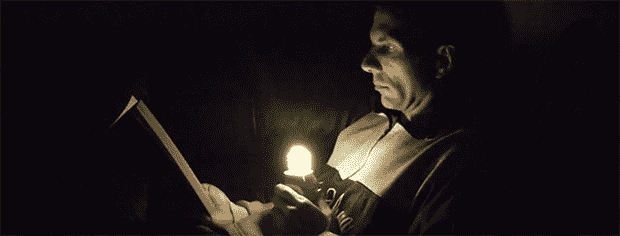

# 荧光灯，由电池供电

> 原文：<https://hackaday.com/2013/07/15/fluorescent-light-powered-by-battery/>

如果你今年夏天要去露营，或者只是想要一个由两节 AA 电池供电的廉价应急灯，你可能没有比[rimstar]的[焦耳小偷紧凑型荧光灯](http://rimstar.org/science_electronics_projects/joule_thief_power_cfl_with_jeannas_light_circuit.htm)更好的了。

[rimstar]的电池供电 CFL 灯泡的电路是一个[焦耳窃贼](http://en.wikipedia.org/wiki/Joule_thief)。虽然这些电路通常用于演示如何通过 LED 从电池中获取最后一点能量，但[rimstar]用更好的变压器和功率晶体管升级了一切，以点亮 CFL 灯泡。

这个建筑真正有趣的地方在于它提供了吹制紧凑型荧光灯的用途。这些灯泡的正常故障模式通常是电子设备坏了，而不是灯管坏了。通过用自制电路替换电子设备，这是重复使用这些坏灯泡的简单方法。

下面视频。

[https://www.youtube.com/embed/FkLET8MhRbU?version=3&rel=1&showsearch=0&showinfo=1&iv_load_policy=1&fs=1&hl=en-US&autohide=2&wmode=transparent](https://www.youtube.com/embed/FkLET8MhRbU?version=3&rel=1&showsearch=0&showinfo=1&iv_load_policy=1&fs=1&hl=en-US&autohide=2&wmode=transparent) [https://www.youtube.com/embed/yz_99oVMbSI?version=3&rel=1&showsearch=0&showinfo=1&iv_load_policy=1&fs=1&hl=en-US&autohide=2&wmode=transparent](https://www.youtube.com/embed/yz_99oVMbSI?version=3&rel=1&showsearch=0&showinfo=1&iv_load_policy=1&fs=1&hl=en-US&autohide=2&wmode=transparent)