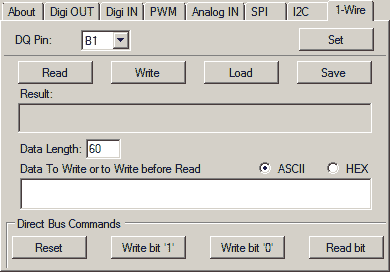

# Flyfish FF32 获得 GUI

> 原文：<https://hackaday.com/2015/07/20/flyfish-ff32-gets-gui/>

[croos]为 Flyfish FF32 写了一个令人印象深刻的 GUI。[飞鱼](http://www.flyfish-tech.com/FF32/index.php#Overview)是一种端口扩展器，允许用户通过 USB 连接访问大量 I/O、模拟输入、SPI、I2C 和其他一些连接选项。没有驱动程序，因为它在它所连接的设备的操作系统中使用本机 HID 驱动程序。它也不仅仅局限于个人电脑。它可以与树莓派，比格犬骨和其他几个 SBC。

[c roos]的 GUI 使得与 FF32 的交互比以往任何时候都更容易。它有一个脚本编辑器，允许你运行和编辑脚本。看起来他实际上已经为脚本编写写了自己的 basic like 语言，他在自己的网站上做了详细介绍。有一个 blinky 脚本示例，以及几个更复杂的示例，将向您展示如何读取温度和控制伺服。

还有能力直接控制硬件，允许你设置引脚，读取固件版本，设置 USB 地址和其他几个选项。如果你有 FF32，一定要看看[croos]的程序，让我们知道它是如何为你工作的。