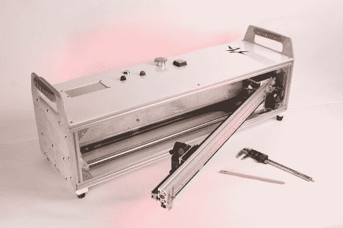

# 折叠式激光切割机原型承诺便携性(但可能不安全)

> 原文：<https://hackaday.com/2014/06/28/fold-out-laser-cutter-prototype-promises-portability-but-maybe-not-safety/>

通常很难为全尺寸激光切割机腾出空间……所以匹兹堡科技商店的一群朋友一直致力于设计一个便于存放的折叠式版本。这仍然是一个原型/概念验证，所以我们暂时忽略明显的安全问题。

它主要由铝挤压件和一些定制的机械零件制成。一个 40W 的 CO2 激光管位于后面，光学系统将其反射到激光头。X 轴在重型铰链机构上旋转，然后锁定在使用位置。不幸的是，没有它在行动的视频，但整个手臂联动显然是相当刚性和强大的。

正如我们所说，这是他们的第一个原型或概念证明之一——随着他们继续改进设计，他们正在考虑将它带到 Kickstarter 上。他们计划封闭光束路径以确保安全，我们当然很有兴趣看看效果如何！

关于这个项目的更多信息，在 Reddit 上有一个帖子很热门。

【谢谢奥利！]