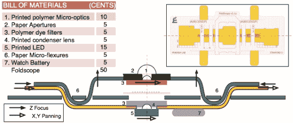

# Foldscope 承诺为每个人提供显微镜！

> 原文：<https://hackaday.com/2014/03/14/foldscope-promises-microscopes-for-everyone/>

斯坦福大学普拉卡什实验室的研究人员发明了一种极其简单的显微镜设计，叫做[折叠镜](http://www.foldscope.com/)，这种显微镜甚至可以在最偏远的地区使用。

Foldscope 是一种光学显微镜，可以由纸张和印刷组件制成，很像一张折纸。它可以放大 2000 倍，制造成本不到 1 美元，并可以提供 800 纳米的亚微米分辨率。它不需要外部电源，适合放在口袋里，并且可以从三层楼的楼顶摔下来。

它利用了新技术，使印刷微光学，微电子，微弯曲，甚至微流体成为可能。只要看看下面的材料清单和解释机制的图表。

该团队正在[寻找 10，000 名测试人员](http://www.foldscope.com/10ksignup/)，你所要做的就是注册，然后用你的 Foldscope，开发一个单页的科学实验或协议——目标是什么？写一个开源的，问题驱动的，生物学和显微镜实验手册！这很酷。

【谢谢卡尔！]