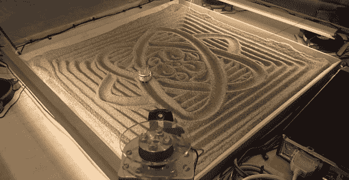

# 四个拉线机拉着我们的线

> 原文：<https://hackaday.com/2013/12/08/four-cable-drawing-machine-pulls-our-strings/>

【大卫】为加拿大 [Telus Spark 科学中心](http://www.sparkscience.ca/)制造了一台[四拉线机](http://dbynoe.blogspot.ca/2013/12/four-cable-drawing-machine.html)。Hackaday 以前展示过[大卫的]非常规绘图装置，特别是他的[中心枢轴笔式绘图仪](http://hackaday.com/2012/09/18/center-pivot-pen-plotter/)。这台绘图机是一台[绘图机器人](http://hackaday.com/2010/06/06/drawbot-produces-portraits-very-slowly/)的新版本，可以被认为是【丹的】[空中摄像机](http://hackaday.com/2012/08/03/building-a-skycam-like-camera-mount/)的近亲。前提很简单:在正方形的每个角上放置一个步进电机和一卷细绳。所有四个马达的弦都集中在一个中心点上。当所有四根弦都绷紧时，重物就从画面上抬起来了。当绳子稍微松弛一点，重力就会把重量拉下来接触沙子。

在这一点上，一个简单的前提变成了一个复杂的实现。向一个方向移动重物就是在一个马达上放出线，在另一个马达上收线。但是那两根“非驱动”弦呢？它们必须足够松弛，以允许在被驱动的方向上运动，但也不能松弛到重量会在沙子上挖掘和翻滚，造成缠结。为了解决这些问题，[大卫]要求[凯文]编写一些软件。[Kevin]为 LinuxCNC 创建了一个自定义运动学模块来控制绘图机。拉丝机运行在 Gerber 代码上，类似于 CNC。只需给机器输入笛卡尔坐标，[凯文的]模块就能转换成步数。

建造这台机器最困难的部分是创造一个导航系统。无论是 CNC、3D 打印机还是四线拉丝机，任何基于步进电机的系统都必须有一个初始位置。步进电机是开环系统。它们移动起来非常精确，但是没有办法说出它们在任何给定时刻的位置。最常用的方法是到达一个已知的“起始”位置，并使用软件来跟踪步数。[大卫的]问题是首先要回到原位。如果他不知道重物在哪里，他就不能放出太多的线，否则他会缠成一团。他的解决方案其实很简单。他命令一个马达收线，告诉其他马达不要动。移动电机比其他电机的保持扭矩更强，这允许它将重量拉起，直到它碰到牵引电机支架上的开关。这种“拔河”会产生各种各样的噪音，并且需要一个结实的机器。不过结果不言自明——[ David 的]机器看起来很棒！

[https://www.youtube.com/embed/hrsDBdnj5E8?version=3&rel=1&showsearch=0&showinfo=1&iv_load_policy=1&fs=1&hl=en-US&autohide=2&wmode=transparent](https://www.youtube.com/embed/hrsDBdnj5E8?version=3&rel=1&showsearch=0&showinfo=1&iv_load_policy=1&fs=1&hl=en-US&autohide=2&wmode=transparent)