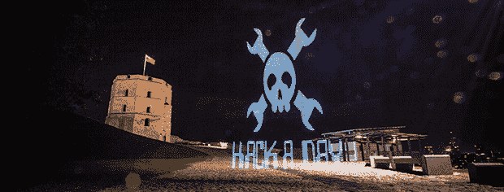

# 四米光绘

> 原文：<https://hackaday.com/2013/09/12/four-meter-light-paintings/>

我们以前见过一些光绘——毕竟，在摄像机前挥舞微控制器和 LED 灯条是一个非常有趣的项目。然而，这种光画棒与我们以前见过的任何东西都不一样。它很大——四米高，在野外也非常灵活，可以从智能手机上绘制图像。

为了将他的照片放到他的光画棒上，[Saulius]使用了非常酷的[杨桃](http://8devices.com/carambola)，这是一个非常小的板，也运行 Python。这些图像被转换成 128 x 的。BMP 文件通过智能手机的 WiFi 提供给杨桃，因为杨桃运行 Linux，有时内核中断会错误地重新启动绘图过程。[Saulius]通过用 C 语言编写绘图代码并将其封装在 Python 模块中找到了一种解决方法。C 的速度和 Python 的灵活性，谁还能要求更多呢。

在项目页面上，你可以看到[Saulius]完成了一些非常酷的光绘。尽管 Hackaday 的标志是登上头版的最佳方式，但这张图片可能是最令人印象深刻的