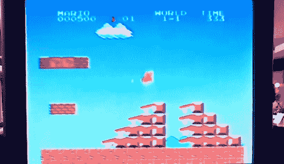

# FPGA 像冠军一样玩马里奥

> 原文：<https://hackaday.com/2013/05/19/fpga-plays-mario-like-a-champ/>

这不是模拟马里奥兄弟的 FPGA，而是通过分析视频和发送控制器命令来玩游戏的 FPGA。这是一个工程课程的期末项目。康奈尔大学的 ECE5760 高级 FPGA 课程，[总是在每次期末项目到期时为我们提供娱乐](http://hackaday.com/2011/12/13/building-the-ocarina-of-time-with-an-fpga/)。

由团队成员[Jeremy Blum]、[Jason Wright]和[Sima Mitra]开发的视频解析是一个黑客。为了工作，他们将 NES 的 240p 视频信号转换为 VGA。这导致了演示视频中的滚动帧显示。它还扰乱了宽高比，并导致其他一些令人头疼的问题，但 FPGA 仍然能够正确地解释图像。

仔细看上面的截屏，你会看到一些不应该在那里的东西。该团队开发了一套测试，用于确定马里奥前进道路上的障碍。红线表示他必须跳过的障碍物。这也适用于他需要避开的坑，用一套不同的测试来探测移动的敌人。一旦它知道要做什么，FPGA 就会模拟必要的控制器信号，将它们推送到老式游戏控制台，看着他安全到达第一关的终点。

我们认为这比其他一些自主马里奥游戏黑客更为核心，因为它修补了原始的控制台硬件，而不是使用模拟器。

[https://www.youtube.com/embed/mVKlyUY9M6Y?version=3&rel=1&showsearch=0&showinfo=1&iv_load_policy=1&fs=1&hl=en-US&autohide=2&wmode=transparent](https://www.youtube.com/embed/mVKlyUY9M6Y?version=3&rel=1&showsearch=0&showinfo=1&iv_load_policy=1&fs=1&hl=en-US&autohide=2&wmode=transparent)