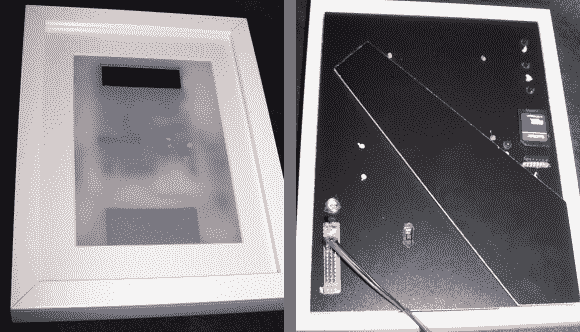

# 框住你的电子项目

> 原文：<https://hackaday.com/2013/02/21/framing-up-your-electronics-projects/>

[Victor]谈到项目外壳时，可能会说到点子上。他用相框来放置他的电子项目。宜家提供的各种尺寸让这一点变得尤为简单。可能最重要的尺寸是有足够的框架厚度，以将您的组件夹在玻璃和框架背板之间。

这里看到的项目是一个温度数据记录器。磨砂扩散器覆盖了除 LCD 屏幕之外的所有东西，让您可以一瞥安装在背板上的东西。他用直角插头将四个不同的原板组件和一个电池组连接起来。然后，他们被绑在框架的背板上，钻一些孔，一点金属丝穿过这些孔。他甚至切了一个洞，以便找到温度传感器的插座，并连接电源输入。因此，他不需要打开框架来获取数据，SD 卡插槽也是可访问的。他的深度调整是通过在框架的每个角落增加支架，并替换固定靠背的金属楔来实现的。

你不需要仅仅用一个来限制自己。这个[紫外线曝光装置](http://hackaday.com/2012/09/24/uv-leds-expose-pcbs-gives-you-a-tan/)使用了三个宜家框架。