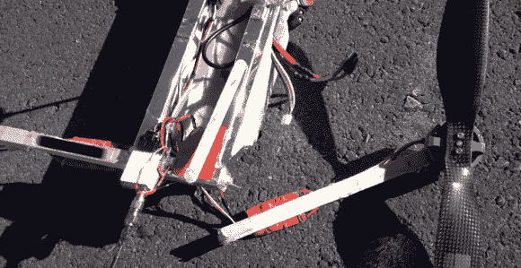

# 自由落体四轴飞行器实验以劈啪声结束

> 原文：<https://hackaday.com/2014/02/06/free-falling-quadcopter-experiments-end-with-splat/>

不要太执着于上面那张伟大的照片，因为拍摄这张照片的四轴摄像机在画面被抓拍时正处于死亡的深渊。自由落体有些诱人的地方。几乎每个三翼/四翼/六翼/多翼飞机的飞行员在飞行时都有切断油门的冲动。大多数四轴飞行器都是固定螺距的，这意味着随着功率下降，控制权限也会下降。一旦断电，它们就会像石头一样掉落。快速油门通常会导致几英尺的高度损失，并使飞行员的脉搏加快。断电时间超过这个时间，事情会变得非常有趣。【rctest flight】[决定深入研究自由落体](http://www.youtube.com/watch?v=nA8_6Oa3_3c)，并专门为此改装了一台试验台四轴飞行器。

首先，简单介绍一下自由落体四轴飞行器及其动力系统。四轴飞行器总是有两个电机顺时针旋转，两个逆时针旋转。这种配置抵消了扭矩，并允许偏航控制。如今大多数大型四轮车使用无传感器无刷电机，这可能对启动条件很挑剔。无刷控制器通常被编程为使电机朝正确的方向旋转。如果电机以每分钟几百转的速度反向旋转，事情就变得有趣了。如果启动的话，在电机启动前通常会有几秒钟的间歇。在这种情况下，控制器 MOSFETS 甚至会被破坏。

当四轴飞行器失去动力时，发动机会减速，推力也会下降。四轴飞行器开始下降。随着下落的四轴飞行器加快速度，由于空气从下方冲上来，螺旋桨开始旋转(风车)。如果四轴飞行器以正常姿态开始下降，所有四个螺旋桨将反向旋转。现在旋转的道具实际上将起到空气制动器的作用，减缓四轴飞行器的下落。这类似于落下的枫树种子，或者直升飞机的自转。旋转的叶片还将充当陀螺仪，这将为下落的四轴飞行器增加一定程度的稳定性。不要误解我们——四轴飞行器在下落时仍然会不稳定，通常会在空中上下摆动。所有这些都不能保证 quad 不会翻倒——这会逆转整个过程。通过所有这些上下摆动、摆动和下落，飞行控制器已经准备好了。我们合作过的大多数飞行控制器在编程时都没有考虑到自由落体，所以不能保证当油门踩到底时它们会重新上线。幸运的是，许多控制器都是开源的，所以测试和改变只是拿你的四轴飞行器冒险。

[RcTestFlight]发现他的 FPV h-quad quad 在自由落体中相对稳定，于是他开始尝试从高空坠落。他发现很多测试都没有好结果。一次碰撞使他的铝制框架严重弯曲，他用更柔软的木头替换了两个扶手。他的 quad 最初有 9 英寸的道具。为了尝试更慢的下沉速度，[RcTestFlight]改用了 14 英寸的道具。更大的螺旋桨也需要更慢的马达和更大的扭矩。经过这些改变后，quad 肯定下降得更慢了，但是他发现下降实际上不如 9 英寸的道具稳定。自动展开的泡沫阻力襟翼进一步减慢了速度，但当特别猛烈的坠落将它们全部扯下时，襟翼本身就成了问题。在将他的四轴飞行器升至 4142 英尺，几乎失去了四轴飞行器，并经历了多次粗暴的坠毁之后，[RcTestFlight]已经完全适应了自由落体。我们希望看到更多的测试，尤其是集体俯仰四轴飞行器。不过，在动力飞行中，我们会保证自己的四胞胎安全。

[https://www.youtube.com/embed/nA8_6Oa3_3c?version=3&rel=1&showsearch=0&showinfo=1&iv_load_policy=1&fs=1&hl=en-US&autohide=2&wmode=transparent](https://www.youtube.com/embed/nA8_6Oa3_3c?version=3&rel=1&showsearch=0&showinfo=1&iv_load_policy=1&fs=1&hl=en-US&autohide=2&wmode=transparent)