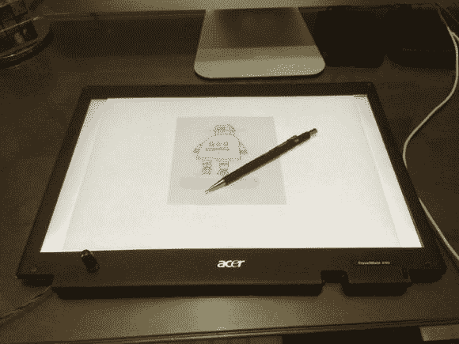

# 从破碎的笔记本电脑屏幕到便携式光桌

> 原文：<https://hackaday.com/2014/08/21/from-broken-laptop-screen-to-portable-light-table/>

如果你像我们中的大多数人一样在 Hack a Day 网站上，你可能会对被扔掉的电子垃圾数量感到不寒而栗——这里有一个聪明的方法来充分利用坏掉的笔记本电脑屏幕！

[Victor]最近从一个朋友那里收到了一台坏掉的笔记本电脑，事实证明，只有 LCD 坏了。虽然它很旧了，但他不想为它买新屏幕。相反，他把它劈成两半，用另一半作为他电视的媒体 HTPC。他正要扔掉屏幕，这时他有了一个主意 LCD 坏了，但背光没有坏！

他小心翼翼地拆开屏幕，取下 LCD 部分，确保背光和各种滤镜都在原位。棘手的部分是让背光工作，即使这并不太难。根据您捐赠的笔记本电脑，它可能是 LED 或 CCFL 背光——如果是 LED，这很简单，如果是 CCFL，您必须想出如何给逆变器板供电才能让它工作。[Victor]对他的进行了逆向工程，并在网上找到了逆变器的原理图，拼凑了一个小电路来给它供电——他甚至添加了一个电位计来实现可变亮度！

打开电源后，你需要一块玻璃来代替其外壳中的 LCD，这样它就可以正确放置— [Victor]从当地的一家玻璃商店购买了一些玻璃来匹配尺寸—现在他有了一个用于草图绘制的便携式光桌！

[https://www.youtube.com/embed/U3F_N6Ddjv4?version=3&rel=1&showsearch=0&showinfo=1&iv_load_policy=1&fs=1&hl=en-US&autohide=2&wmode=transparent](https://www.youtube.com/embed/U3F_N6Ddjv4?version=3&rel=1&showsearch=0&showinfo=1&iv_load_policy=1&fs=1&hl=en-US&autohide=2&wmode=transparent)

如果你正在寻找一个更大的看片台……[从垃圾中拯救一台平板电视！](http://hackaday.com/2008/09/22/broken-lcd-tv-turned-into-a-light-table/)