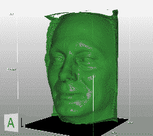

# 从 CT 扫描到 3D 打印

> 原文：<https://hackaday.com/2013/12/19/from-ct-scans-to-3d-prints/>

[the_digital_dentist]在 2007 年做了一次 CT 扫描，以进行牙齿矫正治疗。不知怎么的，他设法从实验室得到了一份 CT 扫描数据的副本，并且最近一直在摆弄它。

由于他有一台 3D 打印机，显然最终目标是使用从 CT 扫描中提取的一些数据打印他的脸。这需要大量的操作才能得到你上面看到的成品模型。他使用一个名为 [DeVIDE](http://www.ohloh.net/p/DeVIDE) 的开源软件来处理数据并导出 STL。他的网站上没有给出太多这方面的信息，但在我们的研究中，我们设法找到了另一个视频，记录了在[的 DeVIDE 上从 DICOM CT 扫描数据中提取 STL 模型的过程。](http://www.youtube.com/watch?v=_PtTpRz3aU8)

不幸的是，STL 在提取出来之后还远没有准备好打印；有许多无关的数据需要清理。他使用网格编辑软件来帮助去除不必要的细节。我们不确定[数字牙医]使用了什么软件，但是[mesh lab](http://meshlab.sourceforge.net/)是一个好软件。

之后，只是打印 STL 文件的问题。但是使用来自 CT 扫描的数据的真正酷的事情是它捕捉的细节的数量……在休息之后留下来看看演示这一点的动画 GIF。

有人想打印一份自己的头骨吗？镀上一层金刚合金会很好看…