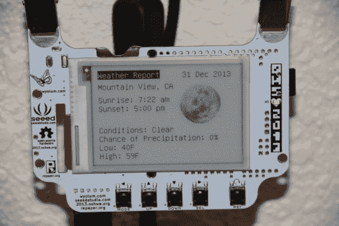

# 从 EPaper 徽章到气象站

> 原文：<https://hackaday.com/2014/01/08/from-epaper-badge-to-weather-station/>

[Jeremy Blum]将他的 2013 年开放硬件峰会徽章，也称为 BADGEr，转换成了一个电子气象站。我们已经在过去的中看到了 2013 年 OHS 徽章[，其中包含的](http://hackaday.com/2013/07/29/2013-open-hardware-summit-badge-includes-epaper-display/ "2013 Open Hardware Summit badge includes ePaper display")[开源 RePaper 显示](http://repaper.org/)使其成为一个有趣的黑客平台。

为了获取天气数据，徽章使用 FTDI 电缆连接到 Raspberry Pi。Python 脚本使用 [Python 天气 API](https://code.google.com/p/python-weather-api/) 来轮询天气数据。然后它使用选择正确图像的 [pySerial](http://pyserial.sourceforge.net/) 向獾发送一系列命令，并插入当前天气数据。最后，使用 cronjob 定期运行脚本，提供定期的天气更新。

如果你刚好有一个徽章，[Jeremy]已经提供了你在 [Github](https://github.com/sciguy14/Pi-BADGEr-ePaper-Weather-Station) 上建立自己的气象站所需的所有文件。否则，你可以看看 RePaper 项目和 [WyoLum 的 eReader Arduino 库](http://wyolum.com/wyolum-ereader-library/)来构建你自己的 ePaper 项目。