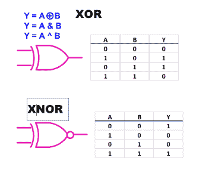
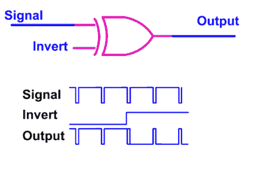
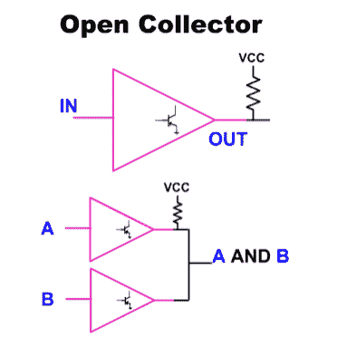
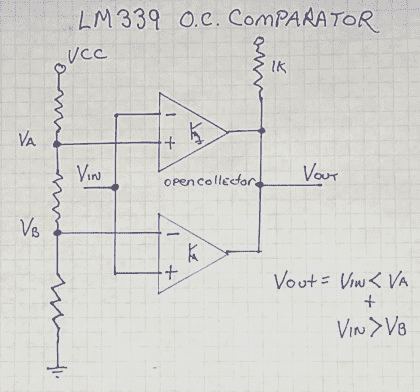
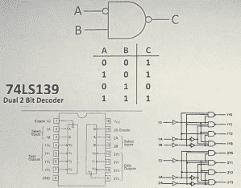
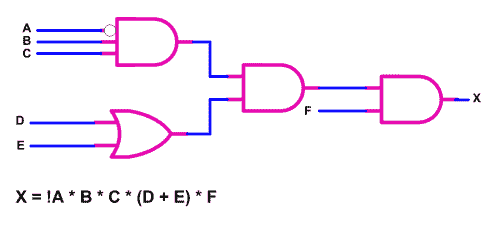

# 从门到 FPGA 第 1 部分:基本逻辑

> 原文：<https://hackaday.com/2015/05/28/from-gates-to-fpgas-part-1-basic-logic/>

是时候做一个关于逻辑的系列了，包括诸如可编程逻辑、状态机和不太为人知的恶魔，如开关危险。最好从头开始——但即使是专家也会喜欢这种复习，甚至可能学到一两个技巧。我将从逻辑符号，交替符号，小型布尔真值表和一些我们能用基本逻辑做的奇怪的事情开始。在视频中可以找到叙述性的版本，在这篇文章的其余部分有完整的参考。

[https://www.youtube.com/embed/WojNC8qwCwU?version=3&rel=1&showsearch=0&showinfo=1&iv_load_policy=1&fs=1&hl=en-US&autohide=2&wmode=transparent](https://www.youtube.com/embed/WojNC8qwCwU?version=3&rel=1&showsearch=0&showinfo=1&iv_load_policy=1&fs=1&hl=en-US&autohide=2&wmode=transparent)

## 转化的

最简单的逻辑是倒置；由高变低或由低变高。这里展示了几种写反转的方法，包括无处不在的“气泡”,我们几乎可以在任何地方使用它来暗示反转或“真低”。如果是 1，现在是 0，以前是低的现在是高的，以前是真的现在是假的。

## 和

继续看与门，我们看到一个简单的真值表，也称为布尔表，它描述了“A 和 B”的功能。这也是我们第一次有机会看到替代符号的应用。在这种情况下,“低或低产生低”

## “与非”

大多数标准逻辑块(如果不是全部的话)也是以反相形式出现的，例如这里所示的与非门。反转逻辑功能的能力在现实生活中非常有用，以至于我在进行中型或更大的系统设计时，使用的与非门数量可能至少是普通与门的三倍。有用的反转可以作为备用或符合逻辑地出现。

## 或/或非

同样,“或”门也是简单、直接的，并且可以作为替代符号画出来。使用 OR 门时，如果其中一个为高电平(包括两个都为高电平)，则输出为高电平。NOR 具有相同的行为，但是它反转输出。比较此处显示的或门和或非门的真值表。

## 异或运算

    

我还建议学习思考逻辑，不仅仅是高和低，或者 1 和 0，还包括真和假的逻辑。特别是在集成度更高的情况下，我们会保存真实信号的实际极性，直到它离开芯片时实际分配到一个引脚和极性。

另一个逻辑函数是“异或”函数，写为 XOR。它的功能是当且仅当一个输入为真时，输出为真。一个很好的例子是作为一个可编程信号发生器，如上图所示。

## 高阻抗或“高阻态”

除了高点和低点，我们还有第三种状态，即高阻态。这是输出禁用时三态使能器件的状态(指三种状态:高、低和高阻态)。这就是多个设备如何访问一个公共资源，如内存，基本上是跳上跳下公共总线。

## 开路集电极

组合输出的另一种方法是使用集电极开路输出，只在低电平方向驱动线路，它们或者关断或者为低电平。多个输出可以合并，而不必担心彼此短路，因为它们只能驱动低电平，而没有人驱动高电平(高电平是被动的)。结果，我们得到了一个 AND 逻辑函数，其中只有当所有输出都处于 Hi-z 状态时，输出才为高。

    

不仅仅是数字器件使用开集输出，右图是一个非常常见的四通道模拟比较器，它使用开集输出，非常适合将模拟信号转换为数字信号。由于能够连接两个集电极开路输出，我们可以合并两条模拟信息。在该窗口比较器中，信号必须得到两个比较器的“批准”,当两个比较器都为真时，电阻可以自由地将输出拉高。

## 逻辑芯片

最后，还有可用作通用功能的标准逻辑芯片，如 74×139、带使能功能的二至四解码器。查看它的逻辑表，我们可以通过选择我们选择的输出来找到一个不寻常的功能。

    

在我结束之前，我想把它放在一起，并显示一些简单的逻辑与方程命名相结合。这种命名法可以扩展到大型项目或高级语言，同时保持简单明了。上面是一个简单的电路，演示了如何使用括号来表示操作顺序。

右边是另一个电路，你能发现小故障的风险吗？

在下一篇文章中，我将讨论常见逻辑系列的电气特性，并介绍可编程逻辑器件和允许我们使用文本编辑器描述硬件的软件。