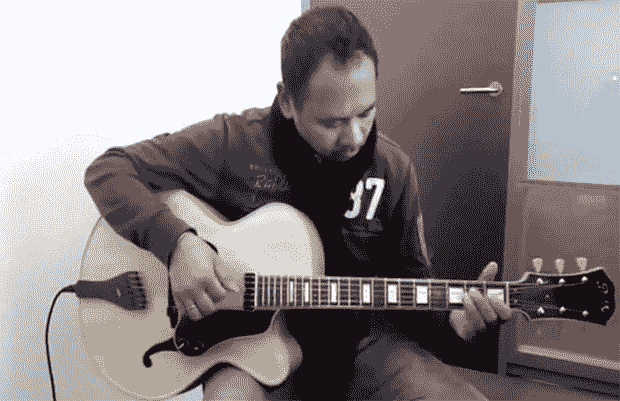

# 从枫树和云杉到顶级吉他

> 原文：<https://hackaday.com/2013/07/05/from-maple-and-spruce-to-an-archtop-guitar/>

虽然小提琴制造商因将木材转化为乐器而获得了大多数赞誉和声望，但你不能否认爵士乐风格的顶级吉他的纯粹美丽和宏伟。吉他的音阶比小提琴或中提琴大得多，但它仍然可以发挥制琴师的精湛技艺，同时增加一些小型弦乐器中没有的有趣的工程挑战。

去年，[Bert van der Meij] [按照现代大师](http://www.youtube.com/watch?v=EEgX5ZxEDQQ)[【Robert Benedetto】](http://www.amazon.com/Making-Archtop-Guitar-Robert-Benedetto/dp/1574240005/)写的圣经，为他的女儿打造了一把顶级吉他。建造开始于采购大块的四分锯开的枫树和云杉，仔细地雕刻云杉顶部和枫树背面。琴颈由三层枫木条制成，仅用手工工具精心制作。

 *在[Bert]的视频中，有一些有趣的例子，展示了在制作这种精致乐器时使用的工具。[Bert]没有分别雕刻顶部的内部和外部，而是只雕刻顶部，并使用设置到一定深度的钻床来粗糙出背面。只需最少的刨削，就能以最少的工作量确保顶部厚度不变。

最终产品是一种足够好的乐器，可以在任何爵士俱乐部的舞台上找到自己的位置，正如几个不同的音乐家在演示视频中所示。这是一件了不起的作品，也是给[伯特]女儿的一份极好的礼物。*