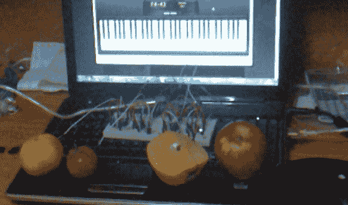
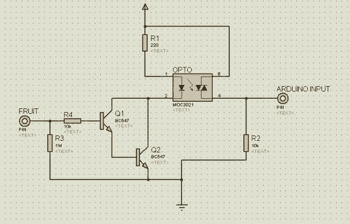

# 水果钢琴使用不同于 Makey Makey 的电路

> 原文：<https://hackaday.com/2013/02/06/fruit-piano-uses-a-different-circuit-than-the-makey-makey/>

[has bi sevinc]在他的电子项目中使用易腐物品。上面看到的橙子、西红柿和两个苹果充当了虚拟钢琴的按键。这个概念和[的 Makey Makey 是一样的，它经常被展示为一架香蕉钢琴](http://hackaday.com/2012/05/25/review-and-a-build-makey-makey-a-banana-piano-and-mario/)。这种实现使用 Arduino 来读取传感器并连接到运行钢琴程序的计算机。

可以看到，试验板上内置了相当多的电路。每一片水果都有自己的通道，使其成为触摸传感器。当你的手指接触食物时产生的信号被连接在达林顿对中的晶体管放大。该电路驱动光隔离器发射器的低端。它的接收端连接到 Arduino 的 I/O 引脚。休息后，您可以看到示意图和演示剪辑。

这种硬件的使用释放了大量的微控制器周期。这是因为像香蕉钢琴这样的项目使用计时器来测量 RC 衰减。[Hasbi 的]设置提供了一个数字信号，最多只需要去抖。

[https://www.youtube.com/embed/P4dTxIU-LgI?version=3&rel=1&showsearch=0&showinfo=1&iv_load_policy=1&fs=1&hl=en-US&autohide=2&wmode=transparent](https://www.youtube.com/embed/P4dTxIU-LgI?version=3&rel=1&showsearch=0&showinfo=1&iv_load_policy=1&fs=1&hl=en-US&autohide=2&wmode=transparent)