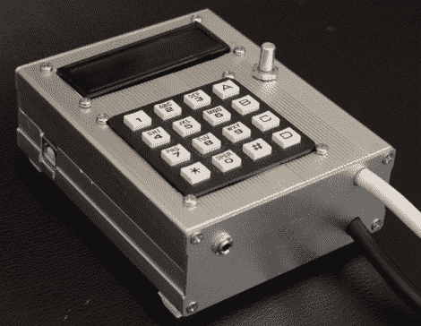

# 模拟打印黑白照片的 F/stop 打印机

> 原文：<https://hackaday.com/2012/07/05/fstop-printer-for-analog-printing-black-and-white-photos/>

这个制作精美的装置是一个计时器，用于在制作照片的胶片照片时获得完美的曝光。除了记录时间，它还可以根据每次曝光的光圈值进行对数计算。它以 1/100 的停止增量完成此操作。当他在做的时候，[William]还决定加入一些其他的特性，比如干燥校正，以及对制作测试条的支持。当抽象地讨论时，这有点难以理解，但只要在休息后看一看他的视频，其中[William]向我们展示了一个曝光示例，一切就会变得清楚了。

从[构造页面](http://www.brodie-tyrrell.org/fstoptimer/construct.html)可以看到，这个设备基本上就是一个 Arduino 盾。它提供了用于控制曝光灯的继电器、键盘、旋转编码器和字符 LCD。把它放在一个漂亮的盒子里，连接到你正在使用的设备上，你马上就能制作出完美的印刷品！

[https://www.youtube.com/embed/P_KJzunWx_0?version=3&rel=1&showsearch=0&showinfo=1&iv_load_policy=1&fs=1&hl=en-US&autohide=2&wmode=transparent](https://www.youtube.com/embed/P_KJzunWx_0?version=3&rel=1&showsearch=0&showinfo=1&iv_load_policy=1&fs=1&hl=en-US&autohide=2&wmode=transparent)