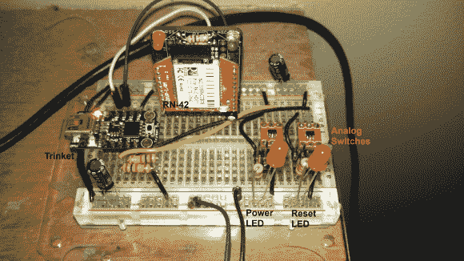

# Fubarino 竞赛:PSU 个人电脑蓝牙控制

> 原文：<https://hackaday.com/2013/12/27/fubarino-contest-bluetooth-control-for-pc-psu/>

[Mike]想远程控制他电脑的电源。但是对他来说，LAN 唤醒并不那么有趣。取而代之的是，他着手制造这款直接操控主板的蓝牙控制器。

作为饰品比赛的获胜者，他把这个项目建立在左边的板子上。还有一个 RN-42 蓝牙模块和几个 TI TS5A3157 模拟开关。一旦原型完成，整个东西将耗尽备用电源，并位于他的电脑机箱内。试验板版本只是切换几个发光二极管，但一旦安装，最终将连接到电源按钮的引脚。

休息后的视频展示了复活节彩蛋。该设备由[迈克的]定制安卓应用程序控制。每 42 次他发送一个电源命令，设备就会用我们的网址回电。

* * *

这是 Fubarino 竞赛的参赛作品，有机会获得微芯片作为奖品提供的 20 块 [Fubarino SD 板中的一块。](http://www.microchip.com/stellent/idcplg?IdcService=SS_GET_PAGE&nodeId=1406&dDocName=en566210)

[https://www.youtube.com/embed/s08A1dtejvM?version=3&rel=1&showsearch=0&showinfo=1&iv_load_policy=1&fs=1&hl=en-US&autohide=2&wmode=transparent](https://www.youtube.com/embed/s08A1dtejvM?version=3&rel=1&showsearch=0&showinfo=1&iv_load_policy=1&fs=1&hl=en-US&autohide=2&wmode=transparent)