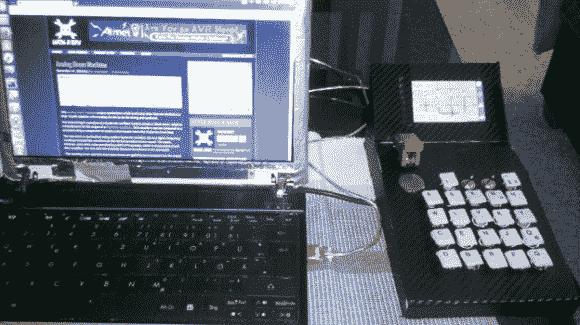

# Fubarino 竞赛:定制机甲战士在线控制器

> 原文：<https://hackaday.com/2013/12/28/fubarino-contest-custom-mech-warrior-online-controller/>

[二十二个按键，一个按钮，三个翻转开关，一个触摸屏](http://neon-society-electronics.com/?p=145)都让【多米尼克】把他的机甲战士网游带到了一个新的高度。他发现游戏中有太多的键绑定，试图让他的行为适应静态键盘布局是一件非常痛苦的事情。控制器不仅给了他一个专门的键盘，而且他还设计了触摸屏界面来充当动态重映射。它甚至看起来像是安装在战斗机甲驾驶舱里的东西！我们不能理解的是，为什么他不早点告诉我们这个性感的外围黑客？

最终促使他向我们透露他的项目的是 Fubarino 竞赛。上面你可以看到[他添加到控制器](http://neon-society-electronics.com/?p=162)的复活节彩蛋。当触摸屏底部的五个按钮被映射到“31337”(又名“elite”)时，驱动控制器的 Teensy 3.0 板将自动在他的浏览器中加载 Hackaday。

* * *

这是 Fubarino 竞赛的参赛作品，有机会获得微芯片作为奖品提供的 20 块 [Fubarino SD 板中的一块。](http://www.microchip.com/stellent/idcplg?IdcService=SS_GET_PAGE&nodeId=1406&dDocName=en566210)

[https://www.youtube.com/embed/CLM1k3aIG80?version=3&rel=1&showsearch=0&showinfo=1&iv_load_policy=1&fs=1&hl=en-US&autohide=2&wmode=transparent](https://www.youtube.com/embed/CLM1k3aIG80?version=3&rel=1&showsearch=0&showinfo=1&iv_load_policy=1&fs=1&hl=en-US&autohide=2&wmode=transparent)