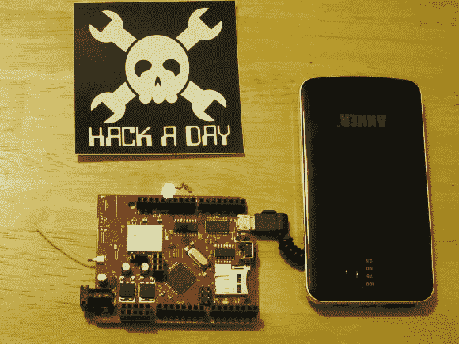

# Fubarino 竞赛示例:一个狡猾的 IRC 机器人

> 原文：<https://hackaday.com/2013/12/05/fubarino-contest-example-a-sneaky-irc-bot/>



你可能听说过 [Hackaday 为赢得 20 块 Fubarino 板中的一块而举办的比赛](http://hackaday.com/2013/12/03/new-contest-win-one-of-20-microchip-fubarino-boards/)。我们包括了一个来自[Mike]的示例条目。这是我参赛的例子:一个由[邪恶设备 WildFire board](http://hackaday.com/2013/11/28/something-wifi-this-way-comes-from-wicked-device/) 驱动的 IRC 搜索机器人。我们以前都见过 IRC 机器人，但你见过多少能在用手机电池供电时打开 LED 的？

IRC 机器人的操作相当简单。它进入一个频道，可以被命令搜索。前两个搜索将返回给定字符串的 Google 搜索链接。然而，每三次搜索就会返回一个到 Hackaday 搜索页面的链接。在下面的例子中，“SedAwk”是一个不知情的用户，“SearchRobot”是我们的机器人。

```

SedAwk: SearchRobot: SEARCH Unicorns
SearchRobot: Search Complete! https://www.google.com/#q=Unicorns
SedAwk: SearchRobot: SEARCH Rainbows
SearchRobot: Search Complete! https://www.google.com/#q=Rainbows
SedAwk: SearchRobot: SEARCH Quadcopters
SearchRobot: Search Complete! http://hackaday.com/?s=Quadcopters
SedAwk: What the heck?

```

休息过后，请继续关注，看看机器人还有什么锦囊妙计…

当机器人进入“1337”模式时，真正的乐趣开始了

```

SedAwk: SearchRobot: 1337
SearchRobot: 1337 H4x0r Mode ENGAGED.

```

该机器人现在会将所有搜索发送到 Hackaday。

要关闭 1337 模式，用户只需告诉机器人它是一个激光雷达

```

SedAwk: SearchRobot: LAMER
SearchRobot: 1337 H4x0r Mode DISENGAGD. Returning to Lamer status.

```

WildFire 有一个连接到 D5 输出的白色 LED。led 由 LED 开和 LED 关控制。

```

SedAwk: SearchRobot: LED ON
SearchRobot: Turning On an LED, because I'm an Arduino after all
SedAwk: SearchRobot: LED OFF
SearchRobot: Turning OFF an LED. Someday I'll grow up to be a 6502

```

我坦率地承认这段代码是从几个来源拼凑出来的，它很可能违反了优秀编程的所有标准，也违反了空间、时间和物理定律。谢天谢地，作为一个黑客贡献者，我没有资格参加比赛。如果你想看看代码，请查看 Github repo 。