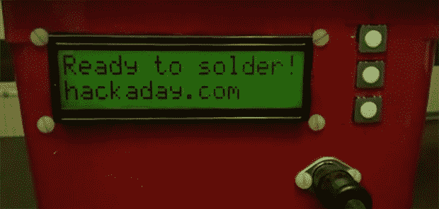

# Fubarino 竞赛:烙铁的黑客日

> 原文：<https://hackaday.com/2013/12/26/fubarino-contest-hackaday-in-your-soldering-iron/>

除了咖啡壶，电子修理工工作台上最重要的工具是烙铁。然而令人惊讶的是，我们还没有看到很多人建立自己的焊接站。[Pjkim]做了，甚至还为我们的 Fubarino 比赛准备了一个复活节彩蛋。

几年前，【pj Kim】[收到了一个危险原型的免费烙铁驱动](http://dangerousprototypes.com/2012/05/29/soldering-iron-driver-v1-5-assembled-and-enclosed/)。[这个令人敬畏的套件](http://www.seeedstudio.com/depot/open-soldering-station-pcb-p-1282.html?cPath=174)提供了你想要的烙铁的一切——USB 和串行数据记录、2×16 显示屏、与一大堆烙铁头兼容，并且它完全可以重新编程。

[Pjkim]在 Fubarino 比赛中的任务是把一个复活节彩蛋放在烙铁的某个地方。他通过在熨斗准备好使用时显示 Hackaday URL 做到了这一点。这也不是唯一的固件修改:新固件还消除了按键抖动，并增加了自动重复功能。

如果你在寻找一些代码，[Pjkim]把所有的东西都放在了黑客论坛上。下面还有一个展示复活节彩蛋的视频。

* * *

这是 Fubarino 竞赛的参赛作品，有机会获得微芯片作为奖品提供的 20 块 [Fubarino SD 板中的一块。](http://www.microchip.com/stellent/idcplg?IdcService=SS_GET_PAGE&nodeId=1406&dDocName=en566210)

[https://www.youtube.com/embed/kanNqTI5M7w?version=3&rel=1&showsearch=0&showinfo=1&iv_load_policy=1&fs=1&hl=en-US&autohide=2&wmode=transparent](https://www.youtube.com/embed/kanNqTI5M7w?version=3&rel=1&showsearch=0&showinfo=1&iv_load_policy=1&fs=1&hl=en-US&autohide=2&wmode=transparent)