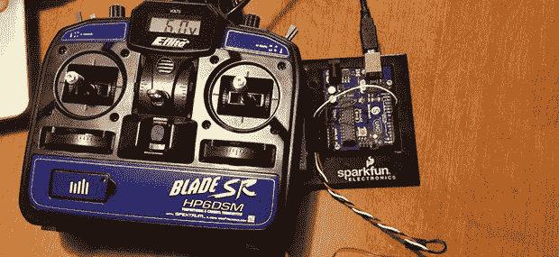

# Fubarino 竞赛:遥控直升机上的黑客日

> 原文：<https://hackaday.com/2013/12/29/fubarino-contest-hackaday-on-an-rc-heli/>

【SF 测试员】(本名，老实说，跟一个给暴雪做 QA 的兄弟)最近捡到一架 Blade SR 遥控直升机。与你可以从易贝或亚马逊花 30 美元买到的廉价同轴直升机相比，这款直升机是一个巨大的进步，但它确实有一个弱点——它自带发射器，将它绑定到[测试者]闪亮的新 DX9 发射器是一件痛苦的事情。

最初尝试将库存变送器的正确值输入到他的 big-boy 变送器中，最初包括将库存变送器、一些伺服系统连接到自制量角器，并手动读取每个轴的值。这是改进他的新玩具的一种蛮力方法，所以[测试者]找到了一种更好的方法。

解决方案来自 Arduino 的 pulseIn()命令。通过将股票接收器连接到 Arduino，[Tester]能够精确读取来自股票发送器的值，并将其导入到他非常别致的 Spektrum DX9 发送器中。

每个 Fubarino 竞赛的参赛作品都需要一个复活节彩蛋，所以当股票发射器发出的脉冲值正好是 1337 微秒时，Arduino 会将 Hackaday 的 URL 发送到串行控制台。巧妙隐藏，这是一个伟大的方式来改善一个可怕的直升机。我们不能要求更多了。

这没有直接的联系，但是你可以在中断后的图像中看到代码。

* * *

这是 Fubarino 竞赛的参赛作品，有机会获得微芯片作为奖品提供的 20 块 [Fubarino SD 板中的一块。](http://www.microchip.com/stellent/idcplg?IdcService=SS_GET_PAGE&nodeId=1406&dDocName=en566210)

