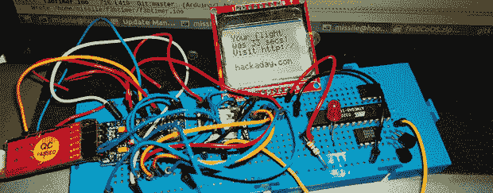

# Fubarino 竞赛:Hackaday 告诉你你是一个糟糕的飞行员

> 原文：<https://hackaday.com/2013/12/21/fubarino-contest-hackaday-tells-you-youre-a-terrible-pilot/>

[Mikko]喜欢驾驶 F3B 赛车——翼展三米的遥控飞机。这些比赛要求飞行员知道他还剩下多少时间，当驾驶遥控飞机到视觉接触的边缘时，根本不可能低头查看秒表。

为了解决这个问题，[Mikko]创造了一个会说话的 F3B 计时器，以 30 秒的增量来宣布飞行时间和剩余时间。它基于 WTV020 音频模块，可以播放 SD 卡中的音频。目前它还处于原型阶段，但他确实有一些在线代码和文档。

至于复活节彩蛋，[Mikko]对他的计时器进行了编程，如果飞行持续了*33 秒(毫秒级分辨率)，黑客日的网址就会显示在诺基亚的 LCD 上。我们打赌，33 秒的飞行时间将与可怕的故障和价值 1000 美元的机身损失高度相关，所以如果他最终在田野里看到这个复活节彩蛋，我们会非常高兴地为他欢呼。*

下面是会说话的计时器说芬兰语的视频，还有一个视频展示了这些巨大的滑翔机能做什么。

* * *

这是 Fubarino 竞赛的参赛作品，有机会获得微芯片作为奖品提供的 20 块 [Fubarino SD 板中的一块。](http://www.microchip.com/stellent/idcplg?IdcService=SS_GET_PAGE&nodeId=1406&dDocName=en566210)

 [https://www.youtube.com/embed/coJH7XpR0mU?version=3&rel=1&showsearch=0&showinfo=1&iv_load_policy=1&fs=1&hl=en-US&autohide=2&wmode=transparent](https://www.youtube.com/embed/coJH7XpR0mU?version=3&rel=1&showsearch=0&showinfo=1&iv_load_policy=1&fs=1&hl=en-US&autohide=2&wmode=transparent)