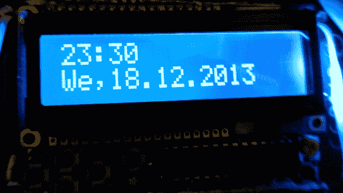

# Fubarino 竞赛:NTP 时钟

> 原文：<https://hackaday.com/2013/12/29/fubarino-contest-ntp-clock/>

[Toni]一直在玩 NTP，网络时间协议。这允许闹钟通过与互联网上的 NTP 服务器同步来保持非常准确的时间。

该项目作为一个床头闹钟。到了早上醒来的时候，闹钟响起，屏幕从使用蓝色背光切换到使用红色背光。这是在下面的视频显示，但你会想在观看之前把你的扬声器；早上闹钟声叫醒你没有问题。在不受欢迎的颠簸之后，你会瞥一眼复活节彩蛋，它会提醒你查看 Hackaday 上的新帖子。

害怕最后得到一堆热气腾腾的渣而不是服务器[Toni]让我们托管项目文件。您可以找到该项目的第一手描述和下面代码的链接。

* * *

这是 Fubarino 竞赛的参赛作品，有机会获得微芯片作为奖品提供的 20 块 [Fubarino SD 板中的一块。](http://www.microchip.com/stellent/idcplg?IdcService=SS_GET_PAGE&nodeId=1406&dDocName=en566210)

[https://www.youtube.com/embed/DGUTrnGTxyI?version=3&rel=1&showsearch=0&showinfo=1&iv_load_policy=1&fs=1&hl=en-US&autohide=2&wmode=transparent](https://www.youtube.com/embed/DGUTrnGTxyI?version=3&rel=1&showsearch=0&showinfo=1&iv_load_policy=1&fs=1&hl=en-US&autohide=2&wmode=transparent)

> NTP 闹钟
> 
> 几周前，我自己做了一个闹钟。为此，我使用了 Arduino 以太网和 Adafruit LCD 保护罩。我决定使用一个旧的纸板盒，把这两个东西都固定在里面，并剪一个孔用于电源连接器、LAN，一个孔用于 Usb 电缆，USB 电缆通向 USB 串行适配器(不知道它们到底怎么叫)。然后我加了一个压电扬声器。现在我有了一个有孔的纸箱和一个显示器。(时钟可以通过电源插头或 usb 供电，就像任何 arduino 一样)
> 
> 让我们来看软件部分。首先，我找到了这个连接到 NTP 服务器的示例代码([http://arduino.cc/en/Tutorial/UdpNTPClient](http://arduino.cc/en/Tutorial/UdpNTPClient))。我包括了我的 RGB LCD 的库，并定义了一些颜色。然后编写了一个导航菜单。使用非常简单:按“向上键”选择时区，用“右/左”键加减。再次“按键”以触发警报激活。完成“选择”。“按键”表示闹钟时间，“按键”表示闹钟分钟，用“选择”完成。然后是睡觉的时间，不要担心背景照明，它在几秒钟的不活动后变暗，尽管屏幕仍然稍微可见。
> 
> 第二天早上，你会被这个闹钟讨厌的闹铃声吵醒。但是有一个挑战。没有“打盹”或“关机”按钮。要使闹钟静音，只需调整闹钟时间。例如，只需在闹钟时间上增加 5 分钟。不久之后，闹钟会再次响起，将时间设置回原来的时间，现在是为第二天做准备。或者只是切换活动，但记得在晚上重新激活。你永远不会睡过头，因为浏览菜单需要一点注意力。闹钟静音后，你肯定是醒着的。
> 
> 但是仍然有事情要做:日期曾经显示一个负数，但是我没有时间去检查是什么导致了这个行为。此外，当在导航菜单中时，屏幕会闪烁，看起来不太好。
> 
> 但你现在可能会问自己，hackaday.com 的网址藏在哪里。答案很简单:每天早上我都会被提醒查看网页，就在闹钟响的时候。多么美好的一天开始啊！

[Arduino 草图](http://hosted.hackaday.com/ntpAlarm_hackaday.ino)