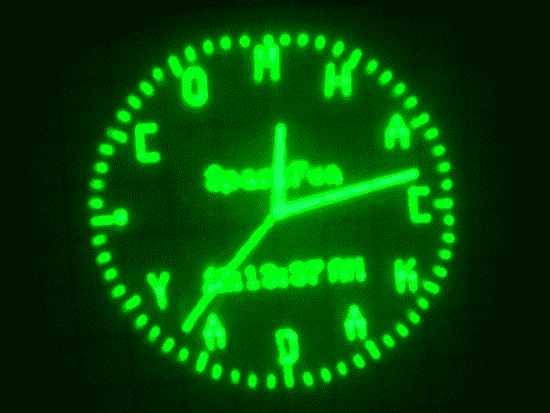

# Fubarino 竞赛:示波器时钟

> 原文：<https://hackaday.com/2013/12/27/fubarino-contest-oscilloscope-clock/>

在听说 Fubarino 竞赛之前，Joseph 从未考虑过在自己的项目中加入复活节彩蛋。但是在看到这么多参赛作品后，我们认为这只是一种有趣的额外活动，需要融入到每一个设计中去！

他条目的主题是一个示波器时钟[，它显示我们的 URL，而不是通常在钟面上看到的数字](http://ceworkbench.wordpress.com/2013/12/19/a-hackaday-fubarino-contest-entry/)。他正在使用一个 SparkFun 板来生成时钟——一个我们在大约 18 个月前看到的硬件[藏在一个老式示波器](http://www.galacticstudios.org/an-oscilloscope-from-the-trash/)里面。仅当结合特殊串行命令显示罗马数字时，该功能才会解锁。

用 URL 替换数字并不完全简单。因为示波器是一个矢量显示器，所以[Joseph]实际上必须为每个字符建立自己的起始和结束坐标阵列。幸运的是，他做了很棒的记录工作，这将允许你让它说任何你想说的话。

* * *

这是 Fubarino 竞赛的参赛作品，有机会获得微芯片作为奖品提供的 20 块 [Fubarino SD 板中的一块。](http://www.microchip.com/stellent/idcplg?IdcService=SS_GET_PAGE&nodeId=1406&dDocName=en566210)