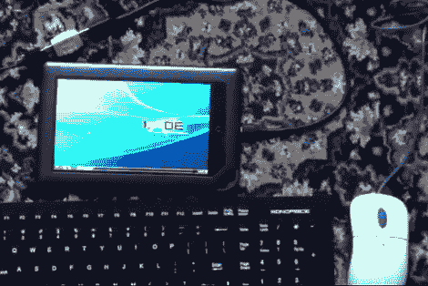

# Nook Color 上的完整 Linux 发行版

> 原文：<https://hackaday.com/2012/04/17/full-linux-distro-on-a-nook-color/>

我们应该在标题中加一个脚注。你可以说[Thomas Polasek]在他的 Nook Color 上安装了完整版的 Arch Linux，但是有一点需要注意。它运行在 Android 内核之上，他的概念验证使用第二台计算机来启动和运行它。但随着时间的推移，这种情况有可能改变。

与之前在 Android 上运行 Linux 发行版的尝试不同，这次不再使用 VNC 来显示桌面。[Thomas]正在征用 Android 的帧缓冲区，以便 X 桌面可以使用它，而无需设置显示驱动程序。首先，他安装了一个基于 CM7 的 ROM。几个 Android 应用程序为他提供了从 SD 卡上运行 Arch Linux 发行版所需的功能。这是通过 SSH 进入平板电脑，并使用“chroot”命令激活它来实现的。希望这可以通过脚本自动完成。

一个母到母 USB 耦合器被用来连接键盘和鼠标到 Nook。看起来没有它们 LXDE 就没用了；触摸控制尚未实现。除了这些缺点，在休息后的视频中，一切似乎都运行得很快。

[https://www.youtube.com/embed/ZZrARL98Qng?version=3&rel=1&showsearch=0&showinfo=1&iv_load_policy=1&fs=1&hl=en-US&autohide=2&wmode=transparent](https://www.youtube.com/embed/ZZrARL98Qng?version=3&rel=1&showsearch=0&showinfo=1&iv_load_policy=1&fs=1&hl=en-US&autohide=2&wmode=transparent)