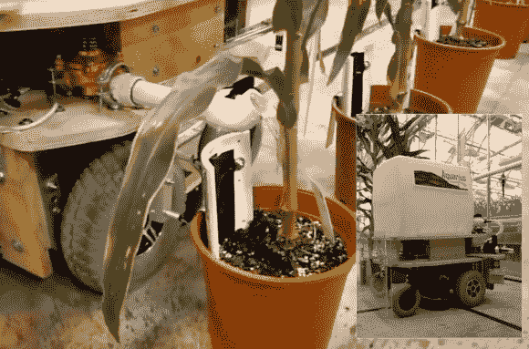

# 全自动浇水机器人向温室自动化迈出了一大步

> 原文：<https://hackaday.com/2013/09/12/fully-automated-watering-robot-takes-a-big-leap-forward-toward-greenhouse-automation/>

温室所有者可能会发现[大卫·多尔豪特]的最新发明是一场突破性的绿色革命！【大卫】的[水瓶座机器人](http://dorhoutrd.com/aquarius_robot)自动化了精确浇灌 9 万平方英尺盆栽植物的费力过程。想象一下，一个躺椅大小的 Roomba，带着一个 30 加仑的水箱，在你的温室周围自主漫游，以绝对完美的方式执行 24×7 浇水家务。水瓶座机器人可以通过三个简单的设置完成这一切；在地板上的过道上添加机器人跟随的线路，根据花盆的大小设置其刻度盘，如果你想在每个花盆中分配完美的水量，也许可以添加一些土壤湿度传感器。选项包括只在不同大小的植物之间增加土壤湿度传感器，让水瓶重复给定系列的第一个植物湿度传感器所需的分配水平。

在[挖掘了](http://forums.parallax.com/showthread.php/149892-Aquarius-The-Greenhouse-Watering-Robot)两个[论坛帖子](http://forums.trossenrobotics.com/showthread.php?6414-Aquarius-The-Greenhouse-Watering-Robot)之后，我们了解到这个机器人由两个视差推进器芯片控制，并有足够的自主编码来开关门，找到充电站，在电量低时装满它的 30 加仑水箱，并准确记住它在两次进站之间离开的位置。我们认为使用 RFID 锅识别标签可以很容易地消除锅大小的拨号，这与[科学博览会分类项目](http://hackaday.com/2012/11/29/science-fair-project-sorts-recyclables/)的方式类似。使用视觉系统，例如几周前的特色 [Pixy](http://hackaday.com/2013/08/21/a-fast-and-easy-to-use-vision-sensor/) ，可以很容易地自动调整植物和花盆的大小以及位置。最后，这里有一些用于土壤湿度感测的特色硬件，可以集成到 Aquarius 中，以帮助远程监控和关注需要关注的植物:[Andy 的][花园传感器](http://hackaday.com/2012/05/14/garden-sensors-measure-soil-moisture-and-greenhouse-temperature/)，[Clover 的][DIY 温室的湿度控制 T11，[Ken_S 的]](http://hackaday.com/2011/07/06/moisture-control-for-a-diy-greenhouse/)[Garden mon(itoring project)](http://hackaday.com/2007/07/23/gardenmonitoring-project/)

[David Dorhout]在农业和生物技术行业拥有 14 年的经验。他有一种独特的天赋，可以应用他的疯狂科学家技术来拯救人类的未来，正如他早期的普洛斯彼罗机器人农夫一样。你可以在 Dorhout R & D [网站](http://dorhoutrd.com/aquarius_robot)上了解更多关于水瓶座的特征，或者观看下面嵌入的视频。

 [https://www.youtube.com/embed/JZC77oN252g?version=3&rel=1&showsearch=0&showinfo=1&iv_load_policy=1&fs=1&hl=en-US&autohide=2&wmode=transparent](https://www.youtube.com/embed/JZC77oN252g?version=3&rel=1&showsearch=0&showinfo=1&iv_load_policy=1&fs=1&hl=en-US&autohide=2&wmode=transparent)