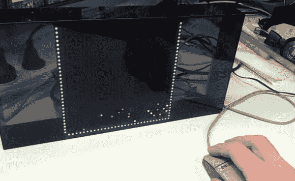

# LED 矩阵和鼠标带来的乐趣

> 原文：<https://hackaday.com/2013/07/15/fun-with-led-matrix-and-mouse/>

[Brad]刚刚获得了一个 32×32 RGB LED 矩阵，他的第一个项目就进入了深水区。为了在这个设备上测试他的技能，他用 Arduino 用弹跳球物理学驱动一系列像素。

演示从多种颜色的下降像素的冰雹风暴开始。风暴的中心是他用 PS2 鼠标控制的光标。这恰好是一个球鼠标，这是有道理的，因为我们不记得最近见过任何非 USB 的光电鼠标。使用微控制器很容易阅读 PS2 协议；在[Brad 的]项目报告中有更多关于这方面的内容。

通过按住鼠标左键，他可以在屏幕上画出持久的像素。下落的球通过从障碍物上弹开而相互作用。上图显示了一个位于屏幕三面的框架，它在底部附近捕捉了像素。他还可以擦除像素，这就像一桶水中的一个洞一样，可以将陷住的球抽干。整洁！

弹跳球物理实验很有趣。这里有一个是由模拟计算机驱动的。

[https://www.youtube.com/embed/ukeJj0znWPw?version=3&rel=1&showsearch=0&showinfo=1&iv_load_policy=1&fs=1&hl=en-US&autohide=2&wmode=transparent](https://www.youtube.com/embed/ukeJj0znWPw?version=3&rel=1&showsearch=0&showinfo=1&iv_load_policy=1&fs=1&hl=en-US&autohide=2&wmode=transparent)