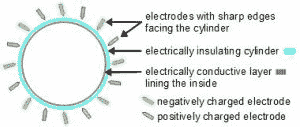

# 看起来时髦的马达是由静电驱动的

> 原文：<https://hackaday.com/2014/08/09/funky-looking-motor-is-powered-by-static-electricity/>

Rimstar.org 的 Steven Dufresne 又做了一个非常实用的科学实验。本周，他向我们展示了他是如何制造大型静电马达的，也被称为[电晕马达。](http://rimstar.org/science_electronics_projects/corona_motor_electrostatic_atmospheric_motor.htm)

电晕电机利用了一种叫做电晕放电的冷
现象，这是通电导体周围的流体
(在这种情况下是空气)的电离。他利用这一点做了其他高压实验，比如他的[离子风推动的星际旅行企业！](http://hackaday.com/2013/12/09/ion-wind-propelled-star-trek-enterprise/)

马达通过使用偶数个电极工作，每个电极都带电；正、负、正、负等。

因为每个电极都是相反的电荷，所以它们想要相互排斥——但是由于圆柱体是电绝缘的，电荷没有地方可去——相反，当电荷来回吸引时，圆柱体开始旋转——当绝缘体上的正电荷遇到带负电的电极时，电荷通过电离被带走(产生电晕效应)，循环继续。旋转方向由电极的角度决定。马达可以转得很快，但没有那么大的扭矩或功率。

关于该项目的完整解释，请看下面视频中[Steve 的]解释:

[https://www.youtube.com/embed/hpvHRHs7o7I?version=3&rel=1&showsearch=0&showinfo=1&iv_load_policy=1&fs=1&hl=en-US&autohide=2&wmode=transparent](https://www.youtube.com/embed/hpvHRHs7o7I?version=3&rel=1&showsearch=0&showinfo=1&iv_load_policy=1&fs=1&hl=en-US&autohide=2&wmode=transparent)

以及如何制作！

[https://www.youtube.com/embed/9uEjXsX1F14?version=3&rel=1&showsearch=0&showinfo=1&iv_load_policy=1&fs=1&hl=en-US&autohide=2&wmode=transparent](https://www.youtube.com/embed/9uEjXsX1F14?version=3&rel=1&showsearch=0&showinfo=1&iv_load_policy=1&fs=1&hl=en-US&autohide=2&wmode=transparent)

这实际上是[史蒂夫]的第二个电晕电机，因为他已经[设计了一个更简单的](http://rimstar.org/science_electronics_projects/how_to_make_corona_motor_simple_one_electrostatic_motor.htm)更容易制造。