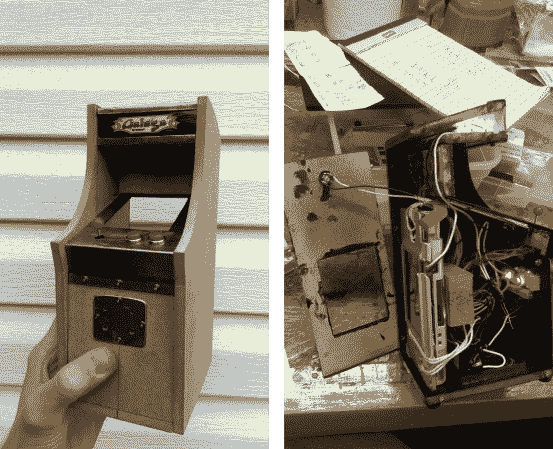

# 使用任天堂 DS 的 Galaga 迷你柜

> 原文：<https://hackaday.com/2013/10/14/galaga-mini-cabinet-using-a-nintendo-ds/>

我们没有向你展示这个小小的 Galaga 街机柜的完成版本，因为它并没有真正证明这个黑客包中的精彩。就功能而言，这个版本简直是疯了！。用户控件被定制成看起来像真的一样，对细节的关注会让玩具屋镀金时代的工匠感到自豪。

**更新:** [eLRIC]留下了一个链接，链接到[一个更好的论坛线程构建日志](http://forum.arcadecontrols.com/index.php/topic,132902.0/all.html)作为评论。除此之外，它充分详细的操纵杆修改。

这台机器由一台任天堂 DS 驱动，它捐赠了它的上屏幕作为橱柜显示器。在右图中，您可以看到，通过机柜背面的一个开口仍然可以接触到下方的显示屏。操纵杆是一个小的多方向开关，通过增加红球来改变。它还被安置在一个定制的金属支架中，该支架包括一个垫圈来限制棍子的移动。右边还显示了字幕灯以及两个投币口。

休息之后，请观看视频，观看比赛。尽管它很大，但它看起来仍然很有游戏性，但是如果你需要更大的东西，你可以在这个项目的基础上建立自己的模型。

[https://www.youtube.com/embed/sz6ya-eJldk?version=3&rel=1&showsearch=0&showinfo=1&iv_load_policy=1&fs=1&hl=en-US&autohide=2&wmode=transparent](https://www.youtube.com/embed/sz6ya-eJldk?version=3&rel=1&showsearch=0&showinfo=1&iv_load_policy=1&fs=1&hl=en-US&autohide=2&wmode=transparent)

[途径[Reddit](http://thegrue.com/tiny-galaga-arcade-powered-nintendo-ds/)途径[起重机](http://thegrue.com/tiny-galaga-arcade-powered-nintendo-ds/)