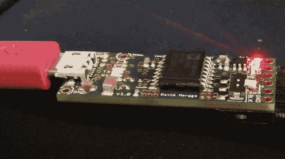

# 电流隔离 FTDI 板节省了您的 USB 端口

> 原文：<https://hackaday.com/2014/04/27/galvanic-isolated-ftdi-saves-your-computer/>

在追求酷黑客的过程中，我们使用了一些危险的电路。高电压，高电流，都需要一些尊重。我们可以轻而易举地保护自己的身体，但那些新奇的笔记本电脑或 Macbook 呢？[David]在这里为他的[隔离式多功能 FTDI 电路提供帮助。](http://hackerspace-ffm.de/wiki/index.php?title=Isolated_versatile_FTDI)

我们的电脑通常直接连接到我们正在入侵的电路中。在过去，这可能是并行或串行端口。如今几乎都是 USB，特别是 USB 串行接口。USB 有一些内置的安全功能，如电流限制。但是，炸掉一个 USB 口，甚至是一块高电压的主板也不是太难。[电流隔离](http://en.wikipedia.org/wiki/Galvanic_isolation)是一种去除两个电路之间任何电气连接的方法。仅举几个例子，仍然可以通过光学、磁性或电容方法进行连接。最简单的电流隔离方法之一是简单的光耦合器。

隔离高速 USB 连接可能会变得有些复杂。[David]明智地选择隔离 FTDI USB 转串行转换器的串行端。他从 SparkFun 的开源 [FTDI 基本突破](https://www.sparkfun.com/products/9716)开始。电流隔离通过 ADI 公司 [ADuM 1402](http://www.analog.com/en/interface-isolation/digital-isolators/adum1402/products/product.html) 或 [ADuM 5402](http://www.analog.com/en/interface-isolation/digital-isolators/adum5402/products/product.html) 实现。1402 在隔离端需要一点功率，而 5402 包括一个隔离的 DC/DC 转换器，可提供高达 60mA 的功率。

[David]不仅仅停留在电流隔离上。他还增加了 ESD 保护、过流保护和多种选项，可在构建电路板时选择。干得好[大卫]！现在我们不用担心我们的笔记本电脑在[炸掉电线](http://hackaday.com/2013/07/07/taking-picture-of-exploding-wire/)时会被烤焦。